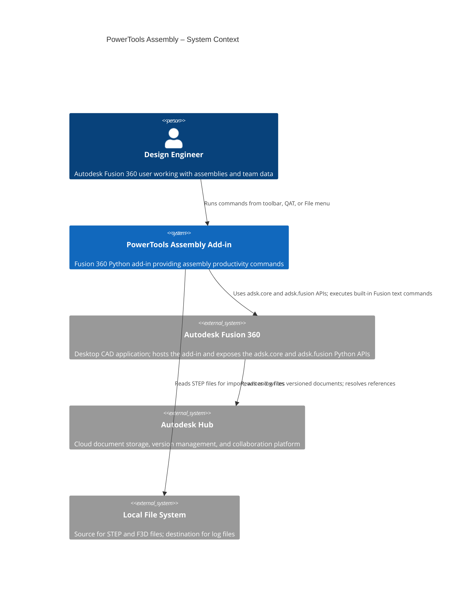
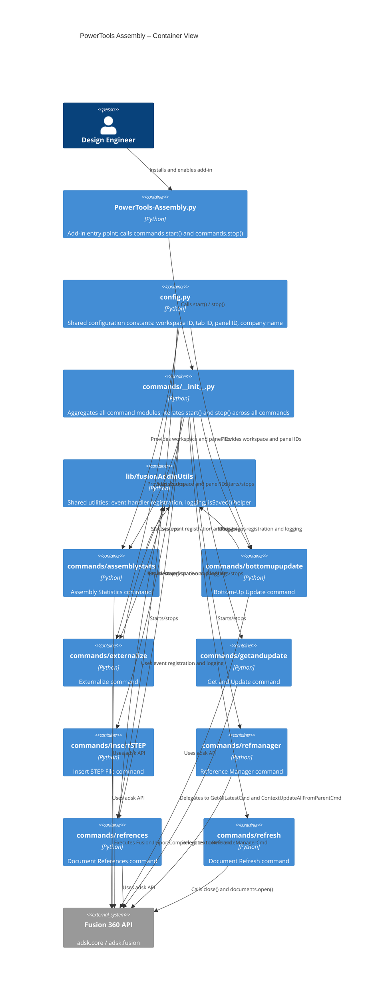

# PowerTools Assembly for Autodesk Fusion 360

PowerTools Assembly is a Fusion 360 add-in that provides productivity commands for teams working with multi-component assemblies and cloud-connected design data. It adds commands to the Design workspace toolbar and Quick Access Toolbar (QAT) that reduce the steps required for common assembly management tasks.

- **Compatibility:** Autodesk Fusion 360 (Windows and macOS)
- **Add-in type:** Fusion 360 Add-In (Python)
- **Author:** IMA LLC

---

## Commands

### Manage document references

**[Document References](./docs/Document%20References.md)**

Displays a dialog listing all documents related to the active design, organized by relationship type. Shows parent assemblies (where-used), child references (uses), associated drawings, standard component references, and related data documents. Each entry includes a thumbnail preview and buttons to open the document in Fusion 360 or in the Autodesk web browser.

**[Reference Manager](./docs/Reference%20Manager.md)**

Opens the Fusion 360 Reference Manager dialog directly from the Quick Access Toolbar. Provides a single location to review all references, update them individually or all at once, select specific versions, and open referenced documents in new tabs.

**[Externalize](./docs/Externalize.md)**

Converts one or more local (inline) components in the active assembly into independent cloud documents, then re-inserts them at their original positions and orientations.

- Externalize a single selected component occurrence.
- Externalize all local first-level components in one step using **Externalize All**.
- Save to the same folder as the active document or to a new named sub-folder.
- Automatically reuse an existing cloud file if one with the same name already exists.

**[Get and Update](./docs/Get%20and%20Update.md)**

Executes **Get All Latest** followed by **Update All Contexts From Parent** in a single Quick Access Toolbar command. Eliminates the multi-click process of retrieving the latest reference versions and then manually refreshing out-of-date assembly contexts.

**[Document Refresh](./docs/Document%20Refresh.md)**

Closes the active document, retrieves the latest version from the Autodesk Hub, and reopens it automatically. Useful in team workflows where other members have published new versions and you want to load them without navigating through the File menu manually.

**[Bottom-Up Update](./docs/Bottom-Up%20Update.md)**

Traverses the assembly hierarchy, opens each referenced component document in dependency order (leaves first), updates its references, optionally rebuilds and applies design intent, and saves it. Processes the entire assembly in a single command.

Key options:
- Rebuild all components to ensure they are current.
- Apply design intent (Part, Assembly, or Hybrid) automatically based on component content.
- Hide origins, joints, sketches, joint origins, and canvases for cleaner saves.
- Skip standard library components and already-saved documents.
- Write a timestamped log file for audit and troubleshooting.

---

### Information

**[Assembly Statistics](./docs/Assembly%20Statistics.md)**

Displays a summary dialog for the active design showing component instance counts, unique component counts, out-of-date reference counts, assembly nesting depth, document context count, assembly constraints, and joint totals broken down by type.

---

### Productivity

**[Insert STEP File](./docs/Insert%20Step.md)**

Opens a local file browser and inserts a selected STEP (`.stp`, `.step`) or Fusion archive (`.f3d`) file as an inline component in the active design. Bypasses the Hub upload and separate-tab workflow for faster local STEP insertion. Particularly useful in ECAD workflows for loading mechanical models into 3D package design tools.

---

## Architecture

PowerTools Assembly is a standard Fusion 360 add-in. Each command is implemented as a Python module in the `commands/` directory. Commands register themselves with the Fusion 360 API on add-in start and remove their UI registrations on stop.

## Installation

1. Download or clone this repository to your local machine.
2. In Fusion 360, open the **Scripts and Add-ins** dialog (**Tools** > **Add-Ins** > **Scripts and Add-Ins**, or press **Shift+S**).
3. On the **Add-Ins** tab, select the **+** button and browse to the folder containing `PowerTools-Assembly.py`.
4. Select the add-in in the list and select **Run**. To load automatically on startup, select **Run on Startup**.

## Uninstalling

1. Open the **Scripts and Add-ins** dialog.
2. On the **Add-Ins** tab, select **PowerTools Assembly** and select **Stop**.
3. To remove it permanently, deselect **Run on Startup** and remove the folder from the add-ins directory.

## License

See [LICENSE](./LICENSE) for details.
