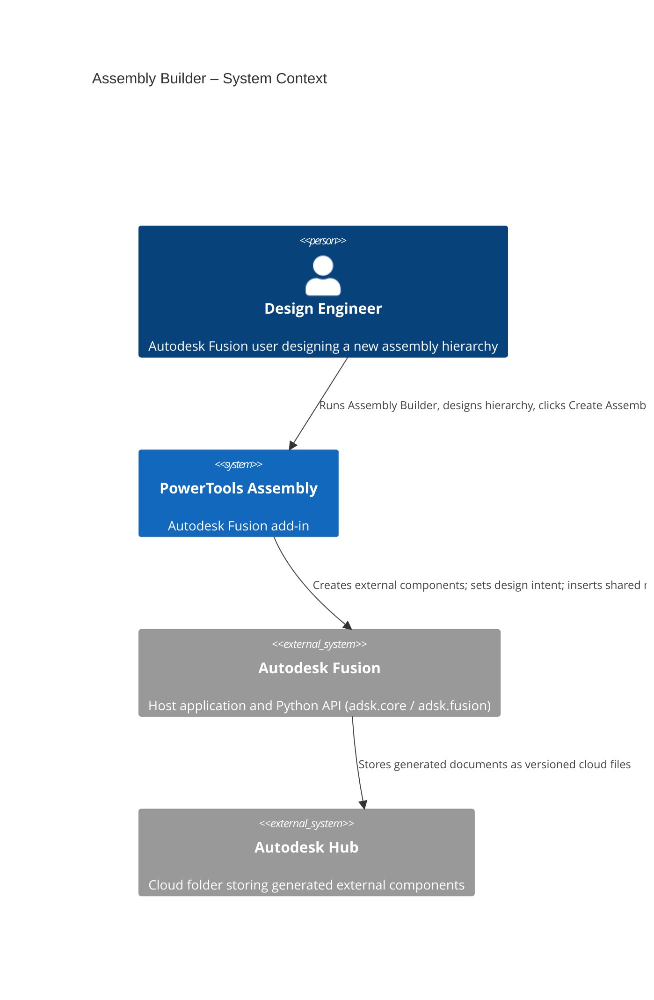
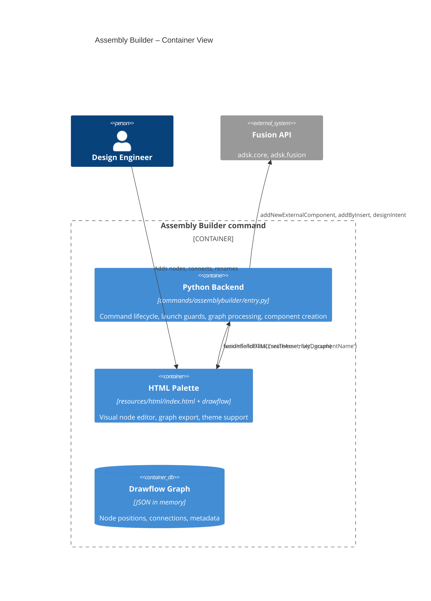
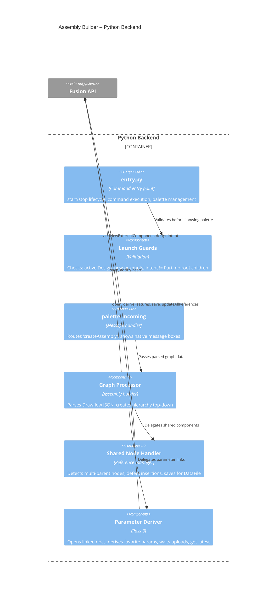
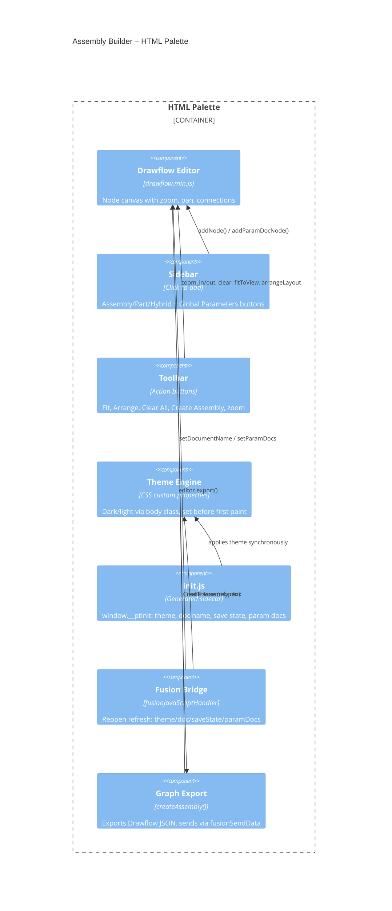
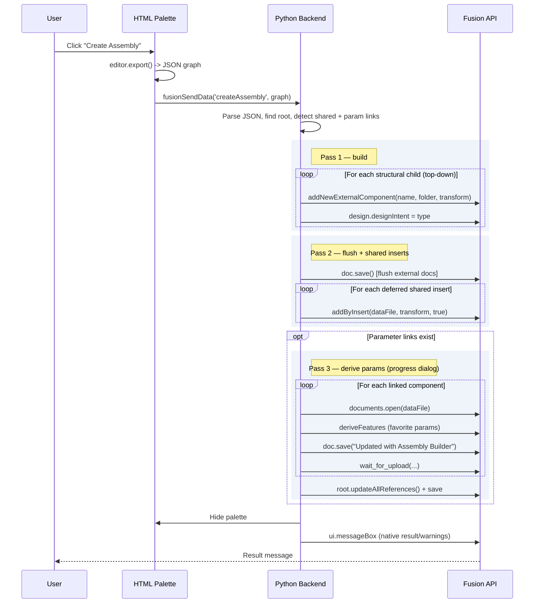
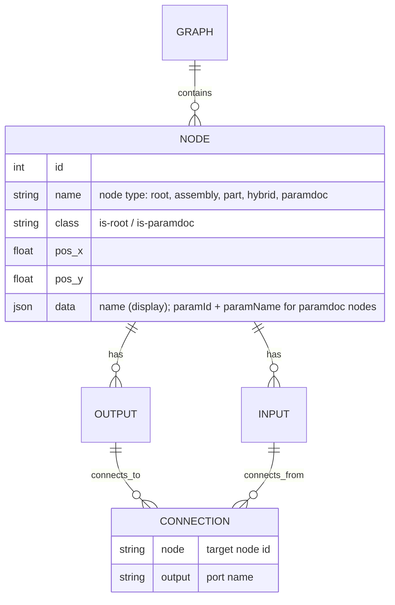

# Assembly Builder

[Back to PowerTools Assembly](../README.md)

The Assembly Builder command opens a visual node editor that lets you design an assembly hierarchy before any components exist. You place Assembly, Part, and Hybrid nodes on a canvas, connect them to form a tree (optionally with shared children), optionally link project **global parameter** sets to specific components, then generate every external component in a single action. Each generated document is created with the correct design intent automatically, shared children are inserted by reference, and linked parameter sets are derived into the components that need them.

## What you can do

- Design an assembly hierarchy in a palette-based visual node editor powered by [Drawflow](https://github.com/jerosoler/Drawflow).
- Add **Assembly**, **Part**, and **Hybrid** nodes by clicking them in the sidebar.
- With a node selected, clicking a sidebar template adds the new node already connected as its child.
- Connect nodes by dragging from the output port (bottom) of a parent to the input port (top) of a child. Connector hit targets are enlarged so wiring is easy without enlarging the visible ports.
- Share a single child between multiple parents by connecting it to more than one parent.
- Add a **Global Parameters** node for any parameter set found in the active project's `_Global Parameters` folder, then connect it to the components that should derive it. Each parameter document can be added once; its button disables while it is on the canvas and re-enables if you delete the node.
- New nodes get incrementing default names per type (`Assembly 1`, `Part 1`, `Hybrid 1`, …); double-click a node's name to rename it before generating.
- **Arrange** lays the graph out as a clean org chart; zoom (Ctrl+scroll) and pan (drag empty canvas); use **Fit** to recenter.
- Generate every external component in one step with **Create Assembly**.
- Design intent is applied per node type automatically (Part / Assembly / Hybrid).
- Palette theme follows the Fusion UI theme — light, dark, or **match OS device theme** — and is correct on first paint.

## Prerequisites

- An Autodesk Fusion 3D Design must be active.
- The active document must be **new (unsaved)**, **or** a **saved document that is still empty** — no timeline features, bodies, sketches, or child components.
- The active design's design intent must be **Assembly** or **Hybrid** (not **Part**).
- The active design must have **no existing child components** at the root.

If any of these conditions is not met, Assembly Builder displays a message explaining what to change and does not open the palette.

> **Note:** When the design contains shared parts or linked global parameters, the document must be saved before generation (these need a cloud `DataFile`). A banner appears across the bottom of the palette and **Create Assembly** is disabled until you save (Ctrl+S); it re-enables automatically. A saved-but-empty starting document satisfies this immediately.

## How to use Assembly Builder

1. In Autodesk Fusion, create a new design with **File > New Design** (or open a saved, still-empty design).
2. Confirm the design intent is **Assembly** or **Hybrid**.
3. On the **Power Tools** panel in the Design workspace, select **Assembly Builder**.
4. Click an **Assembly**, **Part**, or **Hybrid** button in the palette sidebar to add a node to the canvas. Select an existing node first to add the new one already connected as its child.
5. Drag from the output port at the bottom of a parent node to the input port at the top of a child node to connect them.
6. Double-click a node's name to rename it. This name becomes the Fusion component name.
7. To share a child across multiple parents, connect the same child to more than one parent.
8. To apply a project parameter set, click its button under **Global Parameters** in the sidebar and connect the resulting node to each component that should derive it.
9. If the **save** banner is shown (shared parts or global parameters present), save the document (Ctrl+S). **Create Assembly** enables automatically.
10. When the hierarchy is complete, select **Create Assembly**.

Generation runs in three passes:

1. **Build** — the graph is walked top-down and `addNewExternalComponent` is called for each child, applying design intent per node type.
2. **Flush & shared inserts** — the document is saved once to flush the new external documents to cloud `DataFile`s, then each shared child is inserted into its additional parents via `addByInsert`.
3. **Derive parameters** — for every component linked to a parameter node, the component document is opened, the parameter set is derived in (favorite parameters, inserted first in the timeline), and the document is saved. Progress is shown in a dialog (one step per document) and each cloud upload is awaited so versions are current. Finally the root assembly pulls all references to latest (`updateAllReferences`) and is saved.

External component saves and the final root save use the comment **"Updated with Assembly Builder"**.

> **Note:** Because `addNewExternalComponent` requires an Autodesk Hub folder, the active project's root folder is used as the destination. You can move the generated documents afterward in the Data Panel.

> **Note:** All validation and result messages are shown as native Fusion message boxes — there are no browser alert dialogs.

## Access

The **Assembly Builder** command is located on the **Utilities** tab, in the **Power Tools** panel of the Autodesk Fusion Design workspace.

## Architecture

Assembly Builder bridges an HTML/JS palette (running in Fusion's QT WebEngine) and the Fusion Python API. The palette hosts the Drawflow node editor; the Python backend validates launch conditions, receives the exported graph, and creates documents.

### Assembly creation sequence

### Drawflow graph data model

## Design decisions

### Why Drawflow over Flowy?
Flowy only supports tree structures with connections made at drop time. Drawflow supports arbitrary connections between existing nodes, shared components (multi-parent), built-in zoom/pan, and a simpler API.

### Why click-to-add instead of drag-and-drop?
Fusion's QT WebEngine palette intercepts native HTML5 drag events at the widget level before they reach the Chromium rendering layer. Click-to-add uses standard mouse events, which work reliably across Windows and macOS.

### Why top-down creation with `addNewExternalComponent`?
Top-down creation builds the structural tree first. A single flush save then establishes the cloud `DataFile` references that `addByInsert` (shared parts) and document-open (parameter derive) both require — without ever surfacing Fusion's save-as dialog mid-run.

### Why a separate parameter-derive pass?
Deriving favorite parameters requires opening each target component as its own document (the same mechanism used by **Link Global Parameters**). Doing this after the tree is built and flushed means every target already has a `DataFile`. Each per-document save is awaited (cloud uploads are asynchronous) before the root runs `updateAllReferences()`, so the assembly references the freshly-derived versions rather than stale ones.

### Why direct global-parameter links instead of a global toggle?
A `paramdoc` node's output connects to the input of each component that should derive it, so the graph itself records exactly which components get which parameter set — parts included (parts have no output port, so the link is made into the part's input). Each parameter document can be added only once; its sidebar button reflects whether the node is on the canvas.

### Why a generated `init.js` instead of a message handshake?
Fusion's palette loads asynchronously, and `palettes.add()` rejects a query string on the URL. Writing `resources/html/init.js` (theme, document name, save state, parameter docs) **before** creating the palette lets the page read `window.__ptInit` synchronously and apply the theme before the first paint — deterministic, with no round-trip and no flicker. A reopened palette (page already loaded) is refreshed via `sendInfoToHTML` instead.

### Why top-to-bottom node layout?
Assembly hierarchies read naturally as trees flowing downward. Input ports at 12 o'clock (parent connection) and output ports at 6 o'clock (child connections) match this mental model.

---

[Back to PowerTools Assembly](../README.md)

---

*Copyright © 2026 IMA LLC. All rights reserved.*
