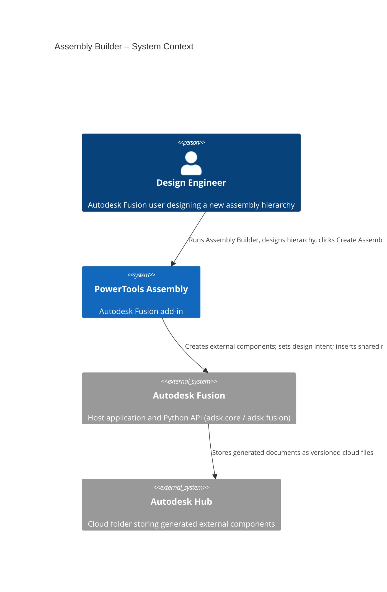
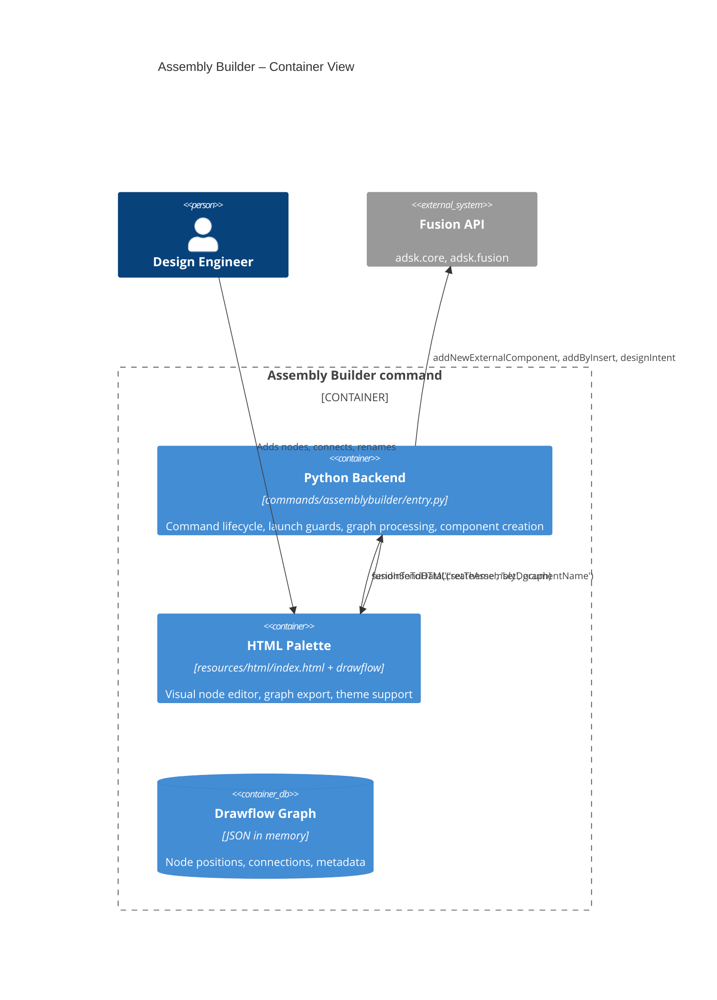
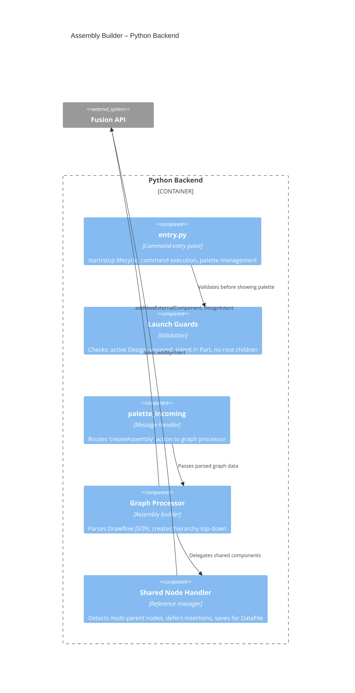
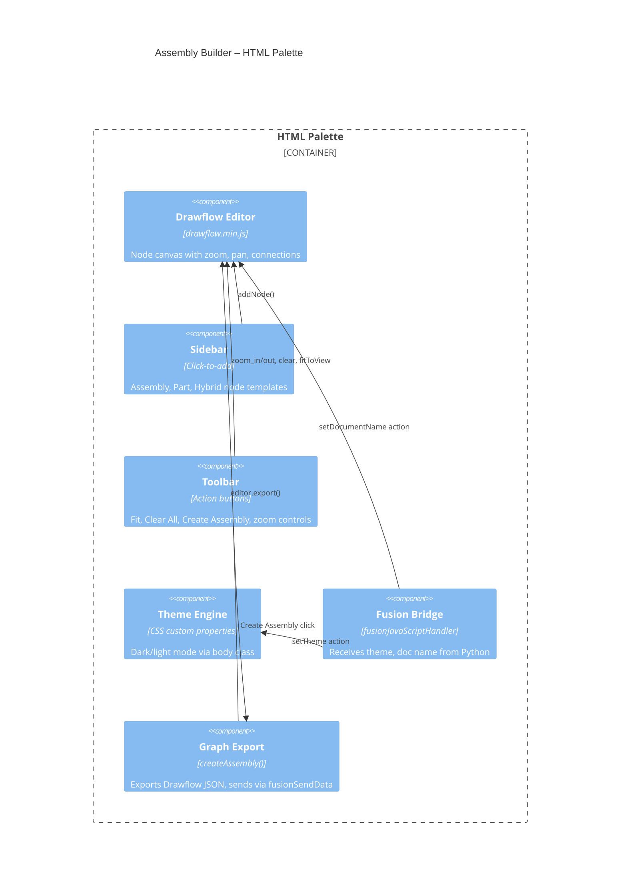
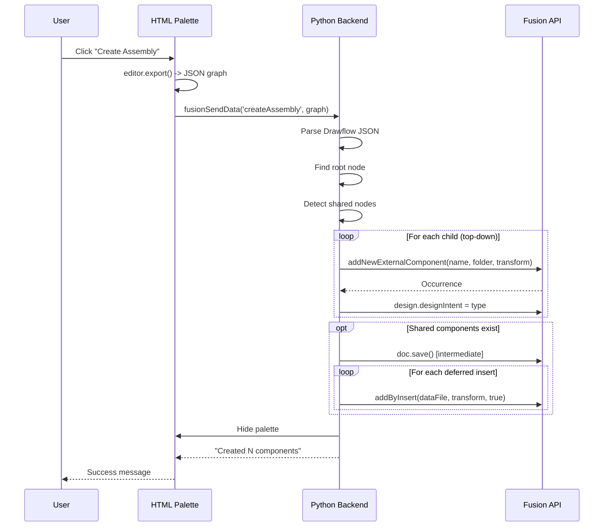
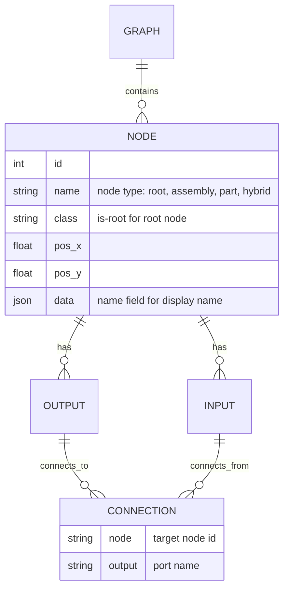

# Assembly Builder

[Back to PowerTools Assembly](../README.md)

The Assembly Builder command opens a visual node editor that lets you design an assembly hierarchy before any components exist. You place Assembly, Part, and Hybrid nodes on a canvas, connect them to form a tree (optionally with shared children), then generate every external component in a single action. Each generated document is created with the correct design intent automatically.

## What you can do

- Design an assembly hierarchy in a palette-based visual node editor powered by [Drawflow](https://github.com/jerosoler/Drawflow).
- Add **Assembly**, **Part**, and **Hybrid** nodes by clicking them in the sidebar.
- Connect nodes by dragging from the output port (bottom) of a parent to the input port (top) of a child.
- Share a single child between multiple parents by connecting it to more than one output.
- Double-click a node's name to rename it before generating.
- Zoom (Ctrl+scroll) and pan (drag empty canvas); use **Fit** to recenter.
- Generate every external component in one step with **Create Assembly**.
- Design intent is applied per node type automatically (Part / Assembly / Hybrid).
- Palette theme follows the Fusion UI theme (light or dark).

## Prerequisites

- An Autodesk Fusion 3D Design must be active.
- The active document must be **new and unsaved** — create it with **File > New Design** immediately before running the command.
- The active design's design intent must be **Assembly** or **Hybrid** (not **Part**).
- The active design must have **no existing child components** at the root.

If any of these conditions is not met, Assembly Builder displays a message explaining what to change and does not open the palette.

## How to use Assembly Builder

1. In Autodesk Fusion, create a new design with **File > New Design**.
2. Confirm the design intent is **Assembly** or **Hybrid**.
3. On the **Power Tools** panel in the Design workspace, select **Assembly Builder**.
4. Click an **Assembly**, **Part**, or **Hybrid** button in the palette sidebar to add a node to the canvas.
5. Drag from the output port at the bottom of a parent node to the input port at the top of a child node to connect them.
6. Double-click a node's name to rename it. This name becomes the Fusion component name.
7. To share a child across multiple parents, connect the same child to more than one parent output.
8. When the hierarchy is complete, select **Create Assembly**.

The command walks the graph top-down and calls `addNewExternalComponent` for each child. If any nodes are shared (connected to multiple parents), the document is saved once automatically to establish cloud `DataFile` references, then `addByInsert` is used to insert the shared component into the additional parents.

> **Note:** Assembly Builder creates external components without saving the overall assembly. After you inspect the generated hierarchy, save the active document manually when you are ready.

> **Note:** Because `addNewExternalComponent` requires an Autodesk Hub folder, the active project's root folder is used as the destination. You can move the generated documents afterward in the Data Panel.

## Access

The **Assembly Builder** command is located on the **Power Tools** panel in the Autodesk Fusion Design workspace.

## Architecture

Assembly Builder bridges an HTML/JS palette (running in Fusion's QT WebEngine) and the Fusion Python API. The palette hosts the Drawflow node editor; the Python backend validates launch conditions, receives the exported graph, and creates documents.

### Assembly creation sequence

### Drawflow graph data model

## Design decisions

### Why Drawflow over Flowy?
Flowy only supports tree structures with connections made at drop time. Drawflow supports arbitrary connections between existing nodes, shared components (multi-parent), built-in zoom/pan, and a simpler API.

### Why click-to-add instead of drag-and-drop?
Fusion's QT WebEngine palette intercepts native HTML5 drag events at the widget level before they reach the Chromium rendering layer. Click-to-add uses standard mouse events, which work reliably across Windows and macOS.

### Why top-down creation with `addNewExternalComponent`?
Top-down creation builds components in-memory without requiring a save, so the user retains full control over when to save. Only shared components (multi-parent nodes) trigger an intermediate save — needed to establish the cloud `DataFile` references that `addByInsert` requires.

### Why top-to-bottom node layout?
Assembly hierarchies read naturally as trees flowing downward. Input ports at 12 o'clock (parent connection) and output ports at 6 o'clock (child connections) match this mental model.

---

[Back to PowerTools Assembly](../README.md)

---

*Copyright © 2026 IMA LLC. All rights reserved.*
