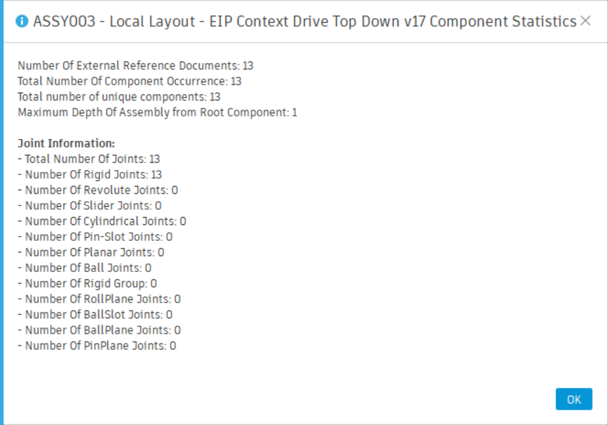
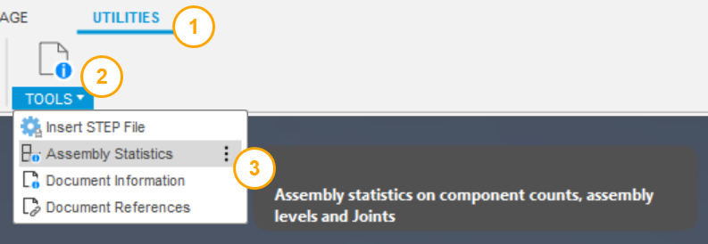
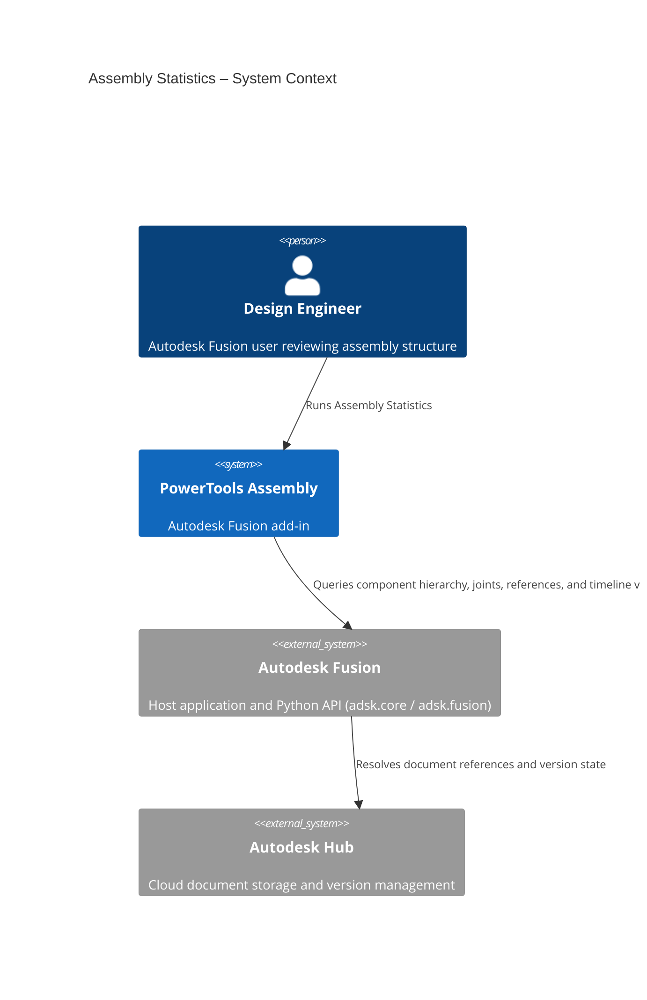
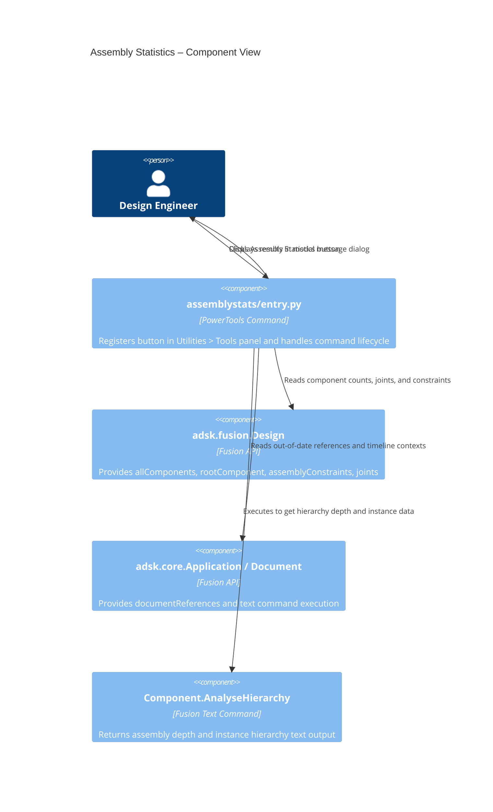

# Assembly Statistics

[Back to PowerTools Assembly](../README.md)

The Assembly Statistics command displays a summary of the structure, component counts, and joint configuration of the active Autodesk Fusion design. Use this command to quickly evaluate the complexity of an assembly without manually inspecting the browser tree.

## What you can do

- View the total number of components in the active assembly, including all nested occurrences.
- View the total number of unique component definitions (local and external).
- View the number of external document references.
- View the number of out-of-date references.
- View the maximum depth (nesting levels) of the assembly hierarchy.
- View the number of document contexts in the timeline.
- View assembly constraints, tangent relationships, and rigid group counts.
- View joint totals broken down by joint type.

## Prerequisites

- A Autodesk Fusion 3D Design must be active.
- The active document must be saved.

## How to use Assembly Statistics

1. Open the Autodesk Fusion Design workspace.
2. On the **Utilities** tab, in the **Tools** panel, select **Assembly Statistics**.
3. Review the statistics displayed in the dialog.
4. Select **Close** to dismiss the dialog.

The dialog reports the following values:

| Statistic | Description |
|---|---|
| Total component instances | Total number of occurrences across all levels of the assembly |
| Unique component definitions | Number of distinct component definitions, excluding the root |
| Out-of-date references | Components whose referenced document has a newer version available |
| Maximum assembly depth | Number of nesting levels from the root to the deepest component |
| Document contexts | Number of assembly context entries in the timeline |
| Assembly constraints | Count of positional constraints on the root component |
| Tangent relationships | Count of tangent relationships on the root component |
| Rigid groups | Count of rigid group constraints on the root component |
| Total joints | All joints defined at the root level |
| Joints by type | Count per joint type (Rigid, Revolute, Slider, Cylindrical, Pin-Slot, Planar, Ball) |

## Access

The **Assembly Statistics** command is located on the **Utilities** tab, in the **Tools** panel of the Autodesk Fusion Design workspace.

## Architecture

The following diagram shows how the Assembly Statistics command interacts with Autodesk Fusion and its data model.

---

[Back to PowerTools Assembly](../README.md)

---

*Copyright © 2026 IMA LLC. All rights reserved.*
