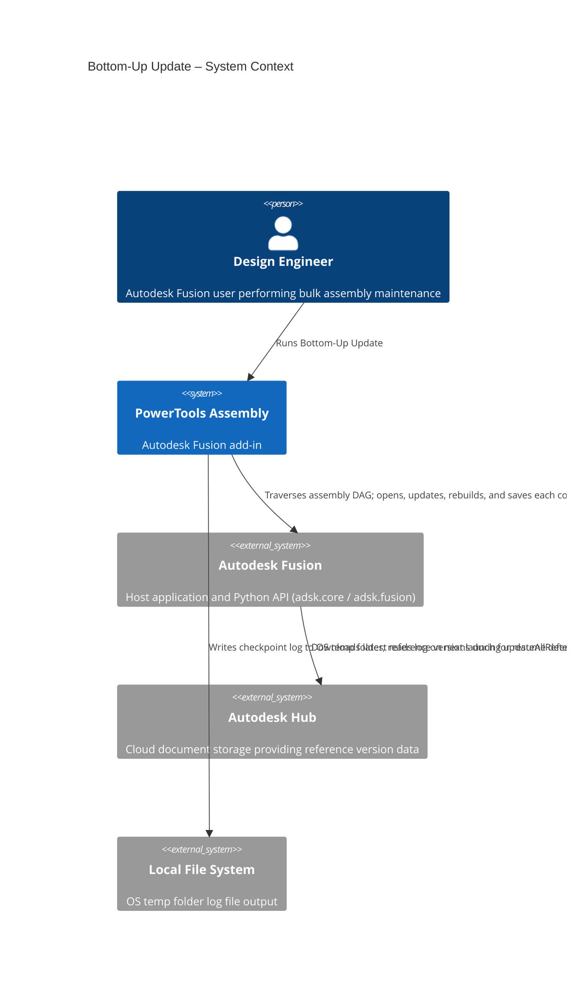
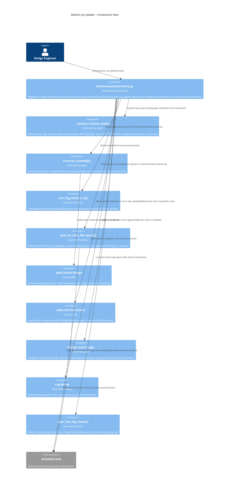
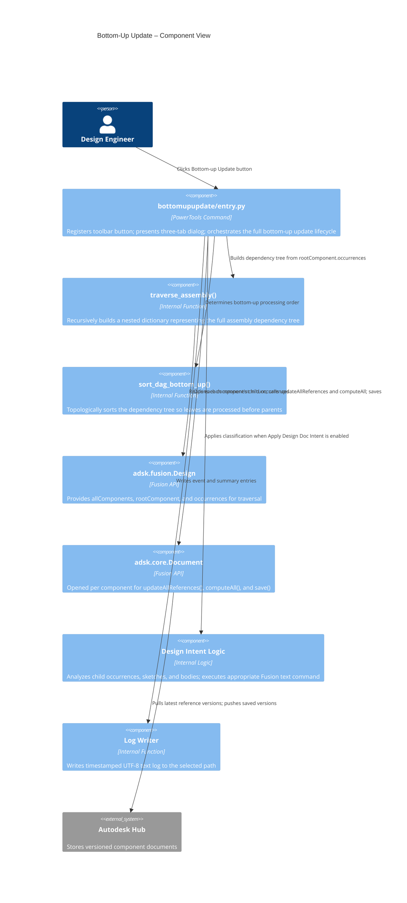

# Bottom-Up Update

[Back to PowerTools Assembly](../README.md)

The Bottom-Up Update command traverses the active assembly hierarchy, then opens, updates, and saves each referenced component document in dependency order — from the deepest leaf components upward to the root. This bottom-up sequence ensures that every component's references are current before the components that depend on it are processed.

## What you can do

- Automatically process all components in a complex assembly in correct dependency order.
- Force a complete rebuild of every component to verify they are up to date.
- Apply design document intent (Part, Assembly, or Hybrid) to each component automatically based on its content.
- Hide origins, joints, sketches, joint origins, and canvases before saving to produce cleaner component files.
- Skip standard library components to avoid unnecessary processing overhead.
- **Smart upload confirmation** — the command confirms that each component's cloud upload has completed before opening the next document, instead of using a fixed pause timer.
- **Resume an interrupted run** — on launch the command inspects the temp log; if the run did not finish and the component list has not changed, it picks up after the last confirmed save+upload checkpoint.
- **Live log viewer** — automatically opens Console.app (macOS) or PowerShell (Windows) to stream log output while the command runs.
- Writes structured progress log with timestamps and checkpoint markers to the OS temp folder.

## Prerequisites

Before running the Bottom-Up Update command, confirm the following:

- A Autodesk Fusion 3D Design is active.
- The active document is saved to an Autodesk Hub.
- The active document contains external references to other components.
- You have write access to all component files that will be processed.

## How to use Bottom-Up Update

1. Open the Autodesk Fusion Design workspace with an active saved assembly that contains external references.
2. On the **Utilities** tab, in the **Tools** panel, select **Bottom-up Update**.
3. Review the **Run status** field on the Main tab. If a previous incomplete run is detected and the component list matches, the command will offer to resume from the last checkpoint.
4. Configure the options in the three-tab dialog (see [Command options](#command-options) below).
5. Select **OK** to begin processing.
6. Monitor progress in the Autodesk Fusion Text Commands window or the automatically opened live log viewer. Do not interrupt the operation.
7. When the command completes, a summary message confirms the number of components processed and the elapsed time.
8. If logging is enabled, review the log file at the path shown in the completion message.

## Command options

The Bottom-Up Update dialog is organized into three tabs.

### Main tab

| Option | Default | Description |
|---|---|---|
| **Run status** | Auto | Read-only. Reports whether this run will start fresh, resume from a checkpoint, or start fresh due to a changed component list or different Fusion client version. |
| **Rebuild all** | Enabled | Forces a complete rebuild (`computeAll()`) of each component to ensure it is current. Disable only when you need to preserve the existing computed state. |
| **Skip standard components** | Enabled | Skips Standard Components library documents (such as McMaster-Carr or Misumi parts) to avoid unnecessary processing. |
| **Skip already saved documents** | Disabled | Skips components whose document version already matches the current Fusion client build string. |
| **Apply Design Doc Intent** | Enabled | Automatically determines and applies the appropriate Fusion document intent to each component. See [Design intent logic](#design-intent-logic) below. |

#### Advanced group (collapsed by default)

| Option | Default | Description |
|---|---|---|
| **Upload check interval (seconds)** | `0.5` | How often to poll upload status after each save. Lower values react faster; higher values reduce API call frequency. |

### Visibility tab

These options hide specific element types in each component before saving. Each option also configures the corresponding folder visibility so that new elements of that type show or hide correctly in future sessions.

| Option | Default | Effect on folder visibility |
|---|---|---|
| **Hide origins** | Disabled | Hides coordinate system origins. |
| **Hide joints** | Disabled | Hides all joints. Sets the Joints folder to **hidden** so new joints do not appear automatically. |
| **Hide sketches** | Disabled | Hides all sketches. Sets the Sketches folder to **visible** so new sketches appear automatically. |
| **Hide joint origins** | Disabled | Hides all joint origin markers. Sets the Joint Origins folder to **visible** so new joint origins appear automatically. |
| **Hide canvases** | Disabled | Hides all canvases. Sets the Canvases folder to **visible** so new canvases appear automatically. |

### Logging tab

| Option | Default | Description |
|---|---|---|
| **Log Progress** | Enabled | Writes detailed processing events to a plain-text `.log` file (UTF-8). |
| **Log file path** | Auto-generated | Defaults to `[DocumentName].log` in the OS temp folder (`/tmp` on macOS, `%TEMP%` on Windows). Select **Browse…** to choose a different location and filename. |
| **Open live log viewer** | Enabled | Automatically launches a native log viewer when the command starts — **Console.app** on macOS, a **PowerShell Get-Content -Wait** window on Windows. |

## Processing sequence

When you select **OK**, the command performs the following steps:

1. **Resume check** — Reads the existing temp log (if present), verifies the recorded Fusion client version matches the running client, compares the logged component list to the current assembly DAG, and determines whether to start fresh or resume from a previous checkpoint. See [Resume behavior](#resume-behavior).
2. **Assembly traversal** — Recursively walks the entire assembly and records all component dependencies as a directed acyclic graph (DAG).
3. **Topological sort** — Sorts the dependency graph in bottom-up order so that leaf components are processed before the assemblies that use them.
4. **Component processing** — For each component in order (starting at the resume index if resuming):
   - Opens the component document.
   - Calls `updateAllReferences()` to bring references up to date.
   - Activates the Fusion Solid Environment workspace.
   - Applies selected visibility options.
   - Applies design intent if enabled.
   - Calls `computeAll()` to rebuild if **Rebuild all** is enabled.
   - Saves the document with a timestamp comment.
   - Waits for the cloud upload to confirm completion before advancing.
   - Closes the component document (the starting root assembly is never closed).
   - Writes a `CHECKPOINT|SAVE_UPLOAD_COMPLETE` entry to the log.
5. **Final assembly update** — Executes **Get All Latest** and **Update All From Parent** on the root assembly, then saves and confirms the root document upload.
6. **Completion report** — Displays a summary with the number of components processed and total elapsed time, and writes the final log entry.

## Resume behavior

Each time the command runs under logging is enabled, the log header includes:

- The current Fusion client version string.
- The full bottom-up component list.
- `CHECKPOINT|SAVE_UPLOAD_COMPLETE|component=<name>|saved_index=<n>|total=<N>|timestamp=<T>` for every confirmed save.

When the command dialog opens, it automatically inspects the temp log:

| Condition | Behavior shown in Run status |
|---|---|
| No temp log exists | "No previous log found. A full run will start." |
| Log is from a different Fusion client version | "Previous temp log is from a different Fusion client version. A full run will start." |
| Prior run completed successfully | "Previous run completed successfully. Log will be reset for a new run." (log is cleared) |
| Prior run incomplete, component list has changed | "Previous run did not complete, but the component save list has changed. A full run will start." |
| Prior run incomplete, component list matches | "Resume available. Next component after '`<name>`' will be processed." |

When resuming, the progress counter and component loop start at the index immediately after the last confirmed checkpoint. The saved-document count is pre-seeded from the checkpoint so final statistics remain accurate.

## Design intent logic

When **Apply Design Doc Intent** is enabled, the command analyzes each component and applies one of the following intents:

| Intent | Criteria | Fusion command applied |
|---|---|---|
| **Part** | Component has no child occurrences (leaf node) | `Fusion.setDocumentExperience Part` |
| **Assembly** | Component has child occurrences but no sketches or bodies | `Fusion.setDocumentExperience xrefAssembly` |
| **Hybrid Assembly** | Component has child occurrences AND contains sketches or bodies | `Fusion.setDocumentExperience xrefAssembly hybridAssembly` |

## Upload confirmation

After each `document.save()` call the command waits for the cloud upload to complete before closing the document or moving to the next component. The mechanism adapts to the Fusion API build in use:

- **`DataFileFuture` returned** — polls `future.isComplete` at the configured upload check interval; reports `future.errorDescription` on failure.
- **`bool` returned (older Fusion builds)** — reads the document's current Hub version via `app.data.findFileById()`, waits for a version bump, then verifies a stable `isSaved == True` / `isModified == False` state for at least one second before advancing.

A 300-second timeout applies in both cases. If the timeout is reached the component is recorded as an error and the run continues.

## Log file content

When logging is enabled, the log file records:

- **Header**: Fusion client version, active document name/project/ID, all selected options, full bottom-up processing order.
- **Per component**: open/close events, reference update confirmations, visibility changes, intent application details, rebuild status, save result, upload confirmation result, and a `CHECKPOINT|SAVE_UPLOAD_COMPLETE` line on success.
- **Final assembly**: `GetAllLatestCmd` and `ContextUpdateAllFromParentCmd` results, root assembly save and upload confirmation, final `CHECKPOINT|SAVE_UPLOAD_COMPLETE` line.
- **Summary**: total components saved, total elapsed time, completion status.

Default log location is the OS temp folder: `/tmp` (macOS) or `%TEMP%` (Windows).

## Best practices

- Save all open documents before running the command.
- Close documents that are not part of the assembly to reduce resource contention.
- Confirm that you have write access to all component files before starting.
- For very large assemblies, consider processing smaller sub-assemblies separately.
- Enable **Log Progress** when troubleshooting to capture detailed error information.
- Leave the default log location (OS temp folder) in place if you want resume detection to work automatically.

## Troubleshooting

| Symptom | Likely cause | Resolution |
|---|---|---|
| "No document references found" error | Active document has no external references | Confirm you are running the command on an assembly with linked components |
| Component skipped unexpectedly | File is locked or write-protected | Check Hub permissions; ensure no other user has the document open |
| Run status shows full run after an interruption | Log was from a different Fusion client build, or the component list changed | Accept the full run; all components will be processed |
| Run status offers resume but you want a fresh start | Previous checkpoint exists | Delete the temp log file shown in the Logging tab before clicking OK |
| Upload wait times out | Slow network or large file | Increase the upload check interval and ensure no Hub connectivity issues |
| Design intent not applied | Component is read-only | Ensure the document is not locked; review the log for intent-specific errors |
| Live log viewer does not open | Console.app not found (macOS) or PowerShell unavailable (Windows) | Open the log file manually from the path shown in the Logging tab |

## Architecture

The following diagrams show how the Bottom-Up Update command fits into the Autodesk Fusion ecosystem and how its internal components interact.





### Topological sort

The command must process components in an order where every component's dependencies are saved before the component that uses them. It achieves this through a two-phase algorithm.

**Phase 1 — Build the dependency tree (`traverse_assembly`)**

Starting from the root component, the function walks `component.occurrences` recursively. Each component is stored as a node in a nested dictionary keyed by component name:

```
{
  "Bracket": {
    "component": <adsk.fusion.Component>,
    "children": {
      "Bushing": { "component": ..., "children": {} },
      "Pin":     { "component": ..., "children": {} }
    }
  },
  "Frame": { ... }
}
```

The result is a directed acyclic graph (DAG) where each node points to its child nodes. Components that appear in multiple sub-assemblies are represented once under the first parent that encounters them; duplicate traversal of the same component name is skipped.

**Phase 2 — Post-order traversal (`sort_dag_bottom_up`)**

The sort walks the DAG using a depth-first, post-order traversal. For any given node it recurses into all children before appending the node itself to the output list. This guarantees that a component only appears in the list *after* all of its dependencies have already been appended.

```
traverse_dag("Bracket")
  → traverse_dag("Bushing")  → append "Bushing"
  → traverse_dag("Pin")      → append "Pin"
  → append "Bracket"
```

The final list is the bottom-up processing order. The command iterates it in sequence, opening, updating, and saving each document before moving to the next. The root assembly is excluded from the list and is saved separately at the end after all components have been processed.

**Why post-order matters**

If a parent component is saved before its children are up to date, Autodesk Fusion resolves the parent's references against the old version of each child. The post-order traversal eliminates this problem: by the time any parent document is opened and saved, every document it depends on has already been updated and saved to the Hub.

---

[Back to PowerTools Assembly](../README.md)

---

*Copyright © 2026 IMA LLC. All rights reserved.*

## Prerequisites

Before running the Bottom-Up Update command, confirm the following:

- A Autodesk Fusion 3D Design is active.
- The active document is saved to an Autodesk Hub.
- The active document contains external references to other components.
- You have write access to all component files that will be processed.

## How to use Bottom-Up Update

1. Open the Autodesk Fusion Design workspace with an active saved assembly that contains external references.
2. On the **Utilities** tab, in the **Tools** panel, select **Bottom-up Update**.
3. Configure the options in the three-tab dialog (see [Command options](#command-options) below).
4. Select **OK** to begin processing.
5. Monitor progress in the Autodesk Fusion Text Commands window. Do not interrupt the operation.
6. When the command completes, a summary message confirms the number of components processed and the elapsed time.
7. If logging is enabled, review the log file at the path shown in the completion message.

## Command options

The Bottom-Up Update dialog is organized into three tabs.

### Main tab

| Option | Default | Description |
|---|---|---|
| **Rebuild all** | Enabled | Forces a complete rebuild (`computeAll()`) of each component to ensure it is current. Disable only when you need to preserve the existing computed state. |
| **Skip standard components** | Enabled | Skips Standard Components library documents (such as McMaster-Carr or Misumi parts) to avoid unnecessary processing. |
| **Skip already saved documents** | Disabled | Skips components that were already saved during the current Fusion session. Enable this option to resume a run that was interrupted. |
| **Apply Design Doc Intent** | Disabled | Automatically determines and applies the appropriate Fusion document intent to each component. See [Design intent logic](#design-intent-logic) below. |
| **Pause after save (seconds)** | 4 | Number of seconds to wait after saving each component. Increase this value for large assemblies or slower network storage. Set to 0 to disable pausing. |

### Visibility tab

These options hide specific element types in each component before saving. Each option also configures the corresponding folder visibility so that new elements of that type show or hide correctly in future sessions.

| Option | Default | Effect on folder visibility |
|---|---|---|
| **Hide origins** | Disabled | Hides coordinate system origins. |
| **Hide joints** | Disabled | Hides all joints. Sets the Joints folder to **hidden** so new joints do not appear automatically. |
| **Hide sketches** | Disabled | Hides all sketches. Sets the Sketches folder to **visible** so new sketches appear automatically. |
| **Hide joint origins** | Disabled | Hides all joint origin markers. Sets the Joint Origins folder to **visible** so new joint origins appear automatically. |
| **Hide canvases** | Disabled | Hides all canvases. Sets the Canvases folder to **visible** so new canvases appear automatically. |

### Logging tab

| Option | Default | Description |
|---|---|---|
| **Log Progress** | Enabled | Writes detailed processing events to a plain-text log file (.txt, UTF-8). |
| **Log file path** | Auto-generated | Defaults to `[DocumentName].txt` in the user's Documents folder. Select **Browse…** to choose a different location. |

## Processing sequence

When you select **OK**, the command performs the following steps:

1. **Assembly traversal** — Recursively walks the entire assembly and records all component dependencies as a directed acyclic graph (DAG).
2. **Topological sort** — Sorts the dependency graph in bottom-up order so that leaf components are processed before the assemblies that use them.
3. **Component processing** — For each component in order:
   - Opens the component document.
   - Calls `updateAllReferences()` to bring references up to date.
   - Activates the Fusion Solid Environment workspace.
   - Applies selected visibility options.
   - Applies design intent if enabled.
   - Calls `computeAll()` to rebuild if **Rebuild all** is enabled.
   - Saves the document with a timestamp comment.
   - Closes the component document.
4. **Final assembly update** — Executes **Get All Latest** and **Update All From Parent** on the root assembly, then saves the root document.
5. **Completion report** — Displays a summary with the number of components processed and total elapsed time, and writes the final log entry.

## Design intent logic

When **Apply Design Doc Intent** is enabled, the command analyzes each component and applies one of the following intents:

| Intent | Criteria | Fusion command applied |
|---|---|---|
| **Part** | Component has no child occurrences (leaf node) | `Fusion.setDocumentExperience Part` |
| **Assembly** | Component has child occurrences but no sketches or bodies | `Fusion.setDocumentExperience xrefAssembly` |
| **Hybrid Assembly** | Component has child occurrences AND contains sketches or bodies | `Fusion.setDocumentExperience xrefAssembly hybridAssembly` |

## Log file content

When logging is enabled, the log file records:

- The active document name, project, and document ID.
- The command execution timestamp and all selected options.
- The full bottom-up processing order.
- For each component: open/close events, reference update confirmations, visibility changes, intent application details, rebuild status, and save events with timestamps.
- Any errors or warnings encountered for individual components.
- Final summary statistics: total components processed, total elapsed time, and completion status.

## Best practices

- Save all open documents before running the command.
- Close documents that are not part of the assembly to reduce resource contention.
- Confirm that you have write access to all component files before starting.
- For very large assemblies, consider processing smaller sub-assemblies separately.
- Enable **Log Progress** when troubleshooting to capture detailed error information.
- Use **Skip already saved documents** to resume an interrupted run without reprocessing completed components.

## Troubleshooting

| Symptom | Likely cause | Resolution |
|---|---|---|
| "No document references found" error | Active document has no external references | Confirm you are running the command on an assembly with linked components |
| Component skipped unexpectedly | File is locked or write-protected | Check Hub permissions; ensure no other user has the document open |
| Incomplete processing after interruption | Session interrupted mid-run | Enable **Skip already saved documents** and re-run |
| Design intent not applied | Component is read-only | Ensure the document is not locked; review the log for intent-specific errors |

## Architecture

The following diagrams show how the Bottom-Up Update command fits into the Autodesk Fusion ecosystem and how its internal components interact.




### Topological sort

The command must process components in an order where every component's dependencies are saved before the component that uses them. It achieves this through a two-phase algorithm.

**Phase 1 — Build the dependency tree (`traverse_assembly`)**

Starting from the root component, the function walks `component.occurrences` recursively. Each component is stored as a node in a nested dictionary keyed by component name:

```
{
  "Bracket": {
    "component": <adsk.fusion.Component>,
    "children": {
      "Bushing": { "component": ..., "children": {} },
      "Pin":     { "component": ..., "children": {} }
    }
  },
  "Frame": { ... }
}
```

The result is a directed acyclic graph (DAG) where each node points to its child nodes. Components that appear in multiple sub-assemblies are represented once under the first parent that encounters them; duplicate traversal of the same component name is skipped.

**Phase 2 — Post-order traversal (`sort_dag_bottom_up`)**

The sort walks the DAG using a depth-first, post-order traversal. For any given node it recurses into all children before appending the node itself to the output list. This guarantees that a component only appears in the list *after* all of its dependencies have already been appended.

```
traverse_dag("Bracket")
  → traverse_dag("Bushing")  → append "Bushing"
  → traverse_dag("Pin")      → append "Pin"
  → append "Bracket"
```

The final list is the bottom-up processing order. The command iterates it in sequence, opening, updating, and saving each document before moving to the next. The root assembly is excluded from the list and is saved separately at the end after all components have been processed.

**Why post-order matters**

If a parent component is saved before its children are up to date, Autodesk Fusion resolves the parent's references against the old version of each child. The post-order traversal eliminates this problem: by the time any parent document is opened and saved, every document it depends on has already been updated and saved to the Hub.

---

[Back to PowerTools Assembly](../README.md)

---

*Copyright © 2026 IMA LLC. All rights reserved.*
