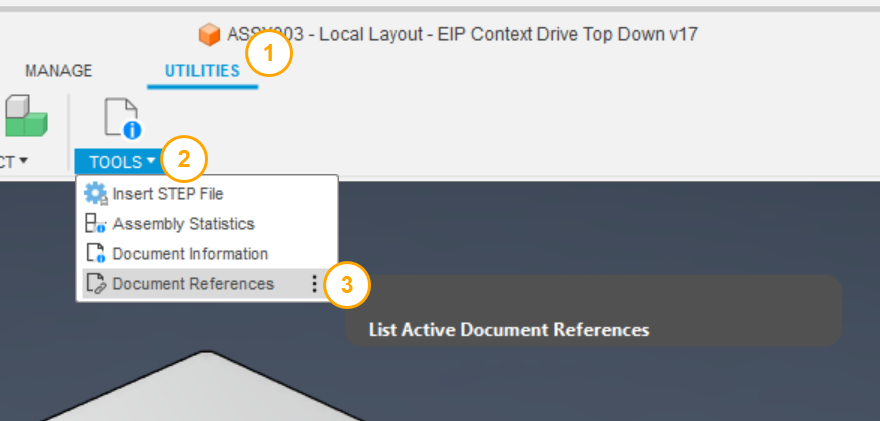
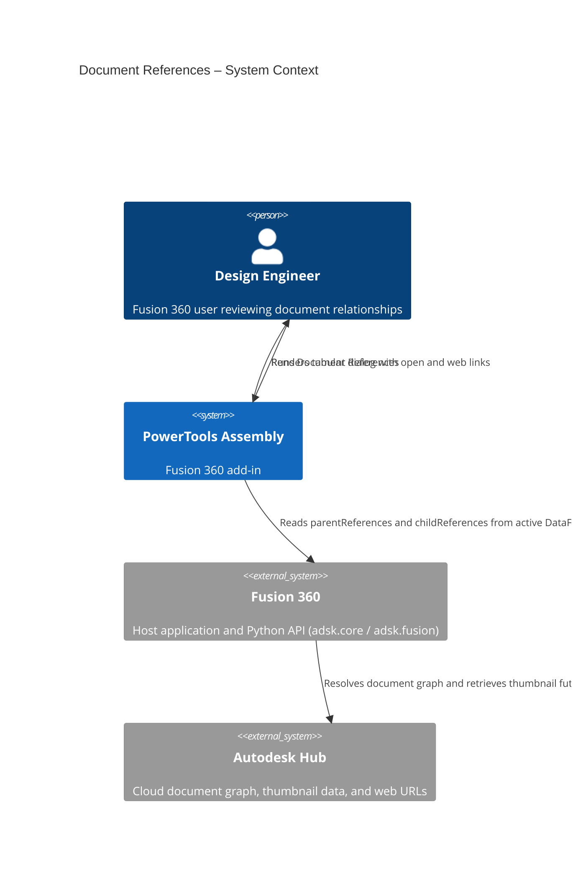
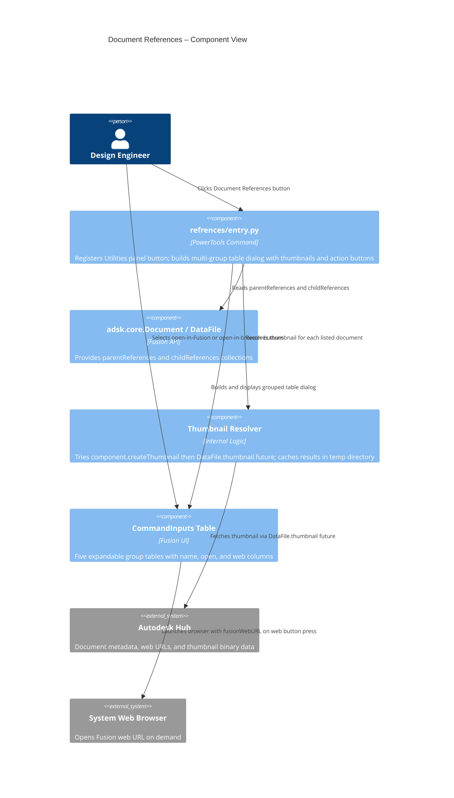

# Document References

[Back to PowerTools Assembly](../README.md)

The Document References command displays a dialog that lists all documents related to the active Fusion 360 design, organized by relationship type. Use this command to understand how the active document fits into a larger project — for example, to identify which assemblies use the active part, which drawings reference it, or which related discipline documents are linked to it.

## What you can do

- View all parent documents that reference the active document (where-used relationships).
- View all child documents that the active document references (uses relationships).
- View all drawings associated with the active document.
- View all standard component (fastener) references used by the active document.
- View all related data documents created with the PowerTools Related Data workflow, separated from structural assembly references.
- Open any listed document directly in Fusion 360 by selecting the open button next to the document name.
- Open any listed document in the Autodesk Fusion web browser by selecting the web button next to the document name.
- See thumbnail previews of each referenced document.

## Prerequisites

- A Fusion 360 3D Design must be active.
- The active document must be saved to an Autodesk Hub.
- An internet connection is required. The command displays a message if you are offline.

## How to use Document References

1. Open the Fusion 360 Design workspace with an active saved design.
2. On the **Utilities** tab, in the **Tools** panel, select **Document References**.
3. The dialog opens and organizes references into the following groups:

   | Group | Description |
   |---|---|
   | **Used In (Parents)** | Assemblies or other documents that reference (use) the active document |
   | **Uses (Children)** | Documents that the active document references as components or links |
   | **Drawings** | Drawing documents (`.f2d`) associated with the active document |
   | **Fasteners** | Standard Components library references used in the active document |
   | **Related Data** | Documents linked through the PowerTools related data relationship (identified by the `‹+›` name marker) |

4. Each row in the dialog shows:
   - A thumbnail preview of the document.
   - The document name.
   - An **Open in Fusion** button (folder icon) to open the document in a new tab.
   - An **Open in browser** button (web icon) to open the document in Autodesk Fusion web.
5. Select **Close** to dismiss the dialog.

> **Note:** Each group heading shows the total count of documents in that group. If a group has no entries, it is shown as empty but remains visible.

## Access

The **Document References** command is located on the **Utilities** tab, in the **Tools** panel of the Fusion 360 Design workspace.

## Architecture

The following diagram shows how the Document References command interacts with Fusion 360 and the Autodesk Hub.

---

[Back to PowerTools Assembly](../README.md)
