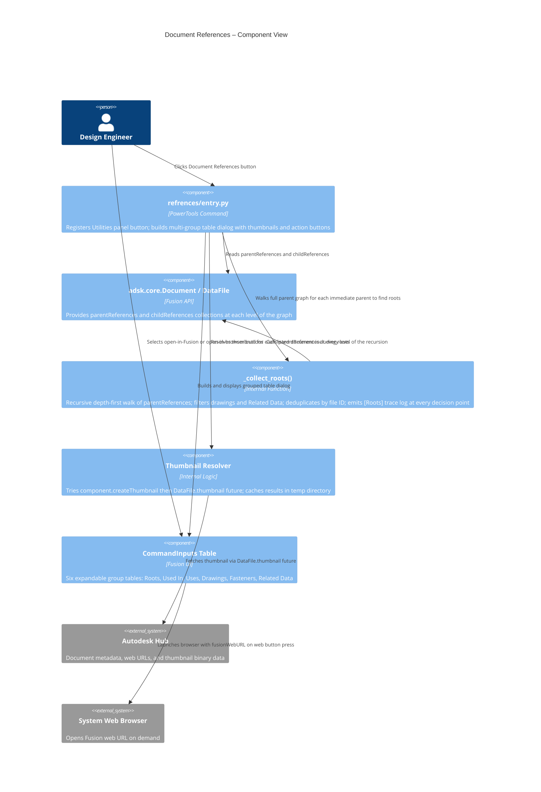
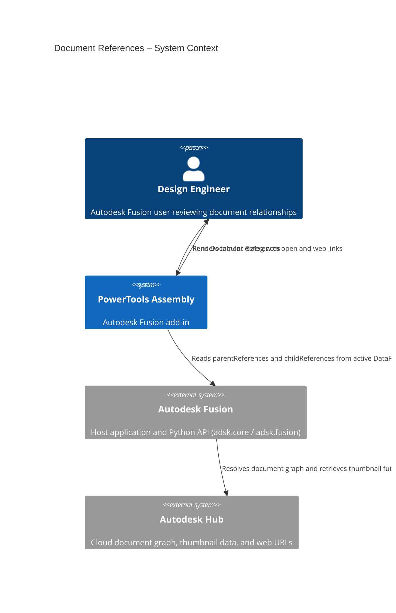
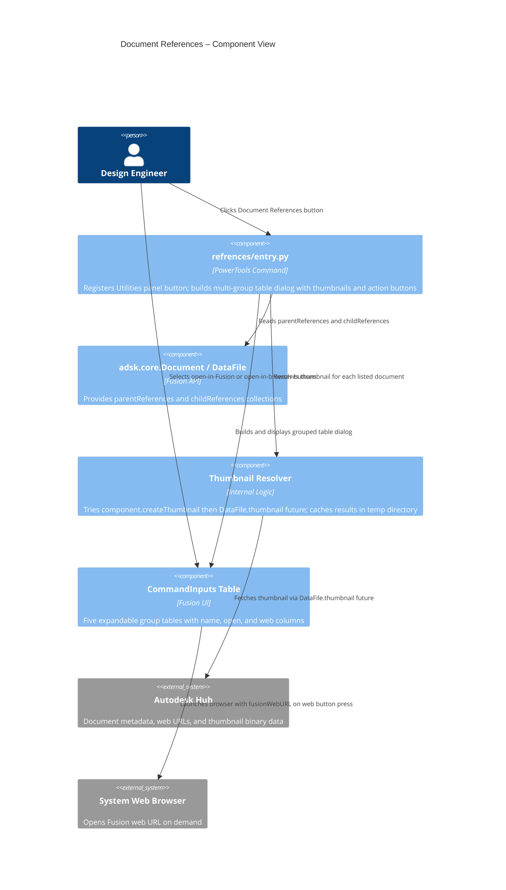

# Document References

[Back to PowerTools Assembly](../README.md)

The Document References command displays a dialog that lists all documents related to the active Autodesk Fusion design, organized by relationship type. Use this command to understand how the active document fits into a larger project — for example, to identify which top-level root assemblies ultimately contain the active part, which assemblies directly use it, which drawings reference it, or which related discipline documents are linked to it.

## What you can do

- **Find root assemblies** — recursively walk the full parent chain to identify every top-level assembly that has no further parents, across any depth of nesting.
- View all immediate parent documents that reference the active document (where-used relationships).
- View all child documents that the active document references (uses relationships).
- View all drawings associated with the active document.
- View all standard component (fastener) references used by the active document.
- View all related data documents created with the PowerTools Related Data workflow, separated from structural assembly references.
- Open any listed document directly in Autodesk Fusion by selecting the open button next to the document name.
- Open any listed document in the Autodesk Fusion web browser by selecting the web button next to the document name.
- See thumbnail previews of each referenced document.

## Prerequisites

- A Autodesk Fusion 3D Design must be active.
- The active document must be saved to an Autodesk Hub.
- An internet connection is required. The command displays a message if you are offline.

## How to use Document References

1. Open the Autodesk Fusion Design workspace with an active saved design.
2. On the **Utilities** tab, in the **Tools** panel, select **Document References**.
3. The dialog opens and organizes references into the following groups:

   | Group | Description |
   |---|---|
   | **Roots** | Top-level assemblies that have no further parents, found by recursively walking the full parent chain. Drawings and Related Data documents are excluded from the chain. The active document itself is never listed here. |
   | **Used In (Parents)** | Assemblies or other documents that directly reference (use) the active document |
   | **Uses (Children)** | Documents that the active document references as components or links |
   | **Drawings** | Drawing documents (`.f2d`) associated with the active document |
   | **Fasteners** | Standard Components library references used in the active document |
   | **Related Data** | Documents linked through the PowerTools related data relationship (identified by the `‹+›` name marker) |

4. Each row in the dialog shows:
   - A thumbnail preview of the document.
   - The document name.
   - An **Open in Fusion** button (folder icon) to open the document in a new tab.
   - An **Open in browser** button (web icon) to open the document in Autodesk Fusion web.
5. Select **Close** to dismiss the dialog.

> **Note:** Each group heading shows the total count of documents in that group. If a group has no entries, it is shown collapsed and empty.

## Roots — recursive parent walk

The Roots section is computed by a depth-first recursive walk of the parent graph:

1. Starting from each immediate parent of the active document, the command calls `parentReferences` on that file.
2. For each parent it encounters it checks:
   - **Skip if already visited** — prevents infinite loops in cyclic or diamond-shaped reference graphs.
   - **Skip drawings** — files with extension `.f2d` are excluded from the walk and are not treated as roots.
   - **Skip Related Data** — files whose name contains the ` ‹+› ` marker are excluded.
3. If a file has **no remaining real parents** after filtering, it is a root and is added to the list (once — duplicates are suppressed by file ID).
4. The active document itself is always excluded from the Roots list even if it has no parents.

### Diagnostics

The root walk emits detailed trace entries to the Fusion **Text Commands** panel (`View → Text Commands`). Each line is prefixed with `[Roots]` and indented by recursion depth:

```
[Roots] Visiting: 'Sub-Assembly A'  id=urn:adsk...
[Roots]   'Sub-Assembly A' raw parents (2): ['Top Assembly', 'Drawing v1']
[Roots]   SKIP parent (drawing): 'Drawing v1'
[Roots]   KEEP parent: 'Top Assembly'
[Roots]   'Sub-Assembly A' has 1 real parent(s) — recursing
[Roots]     Visiting: 'Top Assembly'  id=urn:adsk...
[Roots]     'Top Assembly' raw parents (0): []
[Roots]     ROOT FOUND: 'Top Assembly'
```

Use these traces to verify that drawings and Related Data documents are being excluded correctly and that the active document is not appearing as a root.

## Access

The **Document References** command is located on the **Utilities** tab, in the **Tools** panel of the Autodesk Fusion Design workspace.


## Architecture

The following diagrams show how the Document References command fits into the Autodesk Fusion ecosystem and how its internal components interact.




---

[Back to PowerTools Assembly](../README.md)

---

*Copyright © 2026 IMA LLC. All rights reserved.*

## Prerequisites

- A Autodesk Fusion 3D Design must be active.
- The active document must be saved to an Autodesk Hub.
- An internet connection is required. The command displays a message if you are offline.

## How to use Document References

1. Open the Autodesk Fusion Design workspace with an active saved design.
2. On the **Utilities** tab, in the **Tools** panel, select **Document References**.
3. The dialog opens and organizes references into the following groups:

   | Group | Description |
   |---|---|
   | **Used In (Parents)** | Assemblies or other documents that reference (use) the active document |
   | **Uses (Children)** | Documents that the active document references as components or links |
   | **Drawings** | Drawing documents (`.f2d`) associated with the active document |
   | **Fasteners** | Standard Components library references used in the active document |
   | **Related Data** | Documents linked through the PowerTools related data relationship (identified by the `‹+›` name marker) |

4. Each row in the dialog shows:
   - A thumbnail preview of the document.
   - The document name.
   - An **Open in Fusion** button (folder icon) to open the document in a new tab.
   - An **Open in browser** button (web icon) to open the document in Autodesk Fusion web.
5. Select **Close** to dismiss the dialog.

> **Note:** Each group heading shows the total count of documents in that group. If a group has no entries, it is shown as empty but remains visible.

## Access

The **Document References** command is located on the **Utilities** tab, in the **Tools** panel of the Autodesk Fusion Design workspace.


## Architecture

The following diagram shows how the Document References command interacts with Autodesk Fusion and the Autodesk Hub.





---

[Back to PowerTools Assembly](../README.md)

---

*Copyright © 2026 IMA LLC. All rights reserved.*
