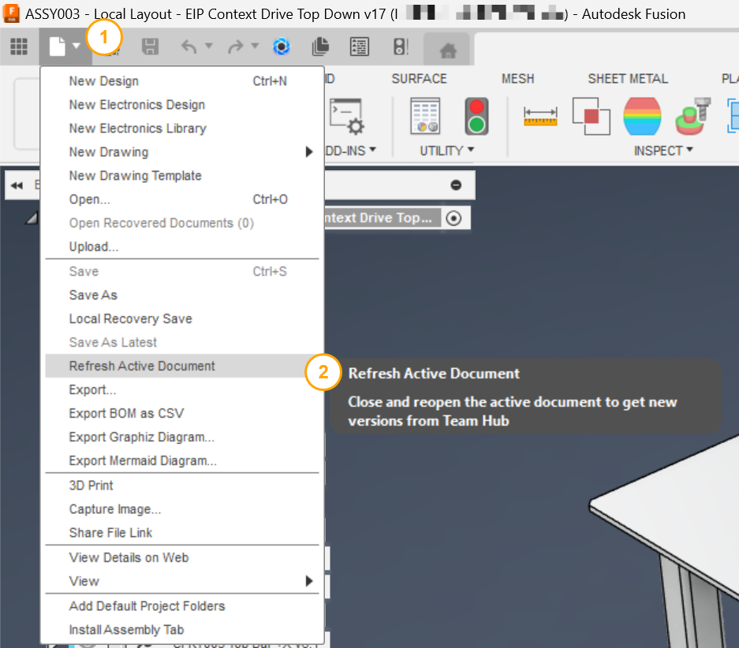
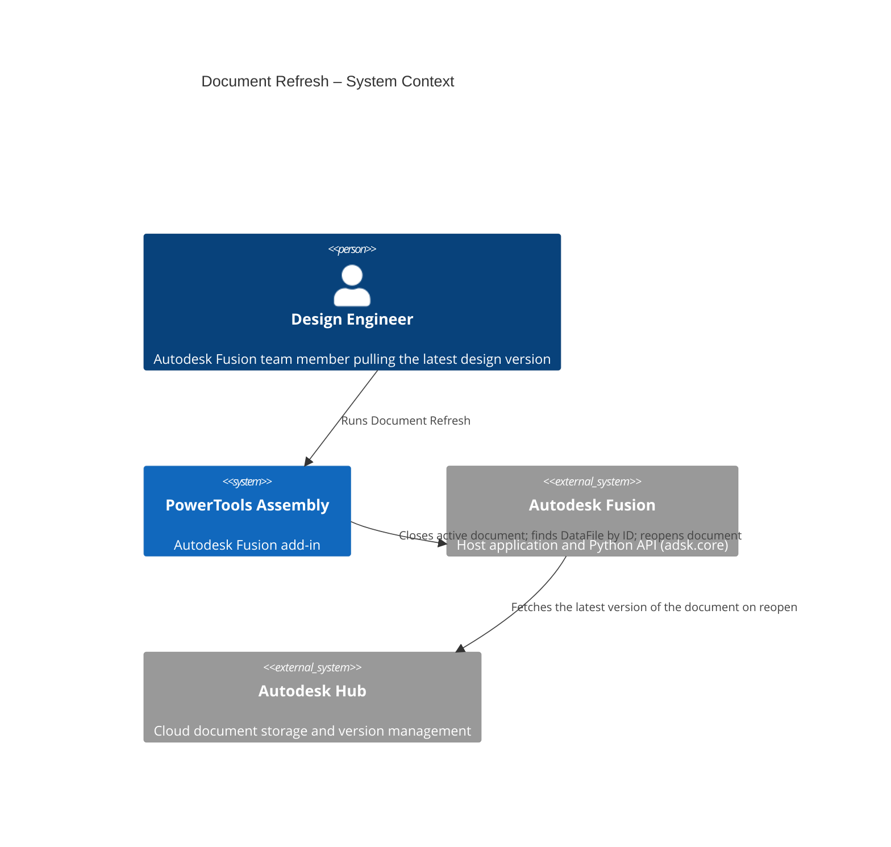
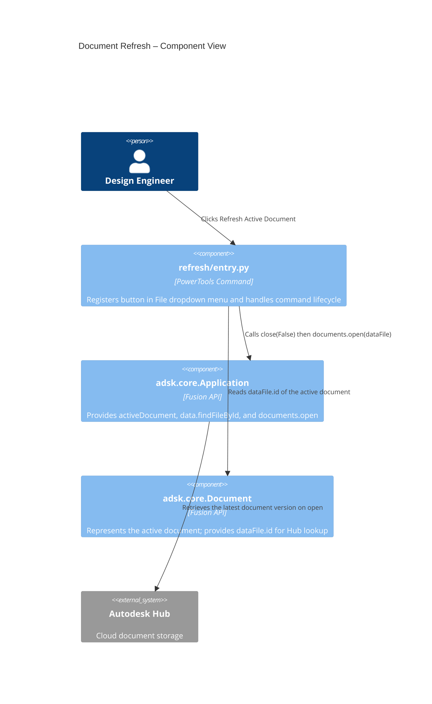

# Document Refresh

[Back to PowerTools Assembly](../README.md)

The Document Refresh command closes the active document, retrieves the latest version from the Autodesk Hub, and reopens it in a single step. Use this command when collaborating with a team and you need to load changes that other team members have published, without manually closing and re-opening the document through the File menu.

## What you can do

- Reload the active document to its latest cloud version in one click.
- Avoid the multi-step process of closing the document, selecting **Get Latest**, and reopening manually.
- Run the command at any time rather than waiting for Fusion to prompt you with the yellow triangle indicator on the Quick Access Toolbar.

## Prerequisites

- A Autodesk Fusion 3D Design must be active.
- The document must be saved to an Autodesk Hub (cloud project). Local documents that are not associated with a Hub cannot be refreshed.
- Unsaved local changes will be discarded. Save any pending work before running this command.

## How to use Document Refresh

1. Ensure any local changes are saved.
2. On the Quick Access Toolbar, select **File**, then select **Refresh Active Document**.
3. Autodesk Fusion closes the active document, retrieves the latest version from the Autodesk Hub, and reopens it automatically.

> **Note:** The close and reopen sequence is instantaneous. Autodesk Fusion displays the document in the same state as when it was last saved to the Hub by any team member.

## Access

The **Refresh Active Document** command is located in the **File** dropdown menu on the Autodesk Fusion Quick Access Toolbar.

## Architecture

The following diagram shows how the Document Refresh command interacts with Autodesk Fusion and the Autodesk Hub.

---

[Back to PowerTools Assembly](../README.md)

---

*Copyright © 2026 IMA LLC. All rights reserved.*
