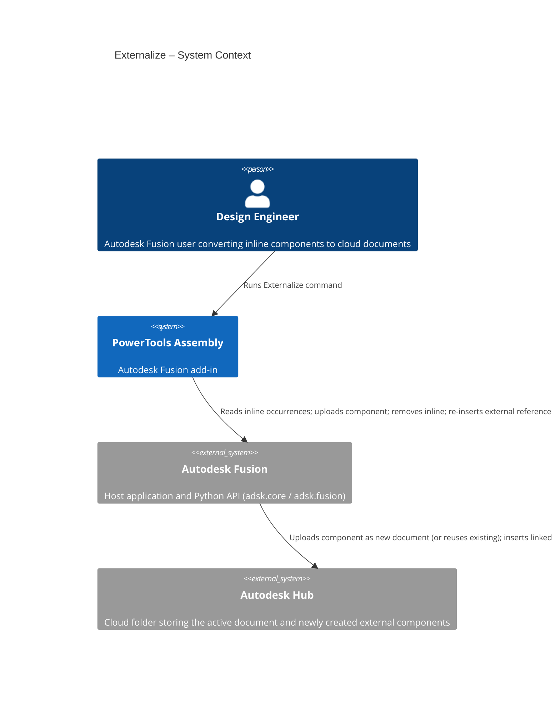
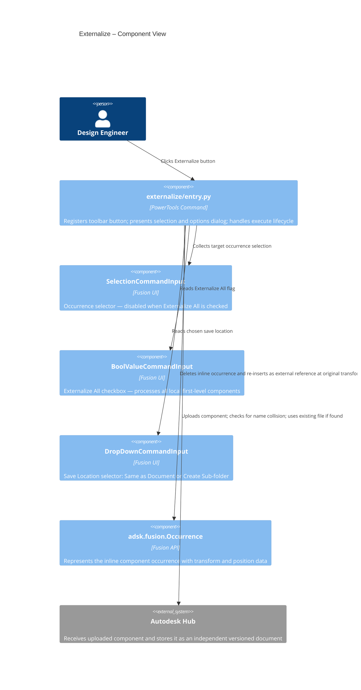

# Externalize

[Back to PowerTools Assembly](../README.md)

The Externalize command converts one or more local (inline) components in the active Autodesk Fusion assembly into independent cloud documents, then re-inserts them at their original positions. Use this command to turn inline geometry into separately versioned, team-shareable files without rebuilding the assembly manually.

## What you can do

- Externalize a single selected component occurrence in the active assembly.
- Externalize all local first-level components in the active assembly simultaneously with the **Externalize All** option.
- Save externalized components to the same folder as the active document, or to a new sub-folder named after the active document.
- Reuse an existing cloud file automatically if a file with the same name already exists in the target folder.
- Preserve the position and orientation of each component exactly as it was in the original assembly.
- Receive a progress indicator and summary report when externalizing multiple components.

## Prerequisites

- A Autodesk Fusion 3D Design must be active.
- The active document must be saved to an Autodesk Hub folder. The command saves external components to that same Hub folder (or a sub-folder of it).

## How to use Externalize

### Externalize a single component

1. Open the Autodesk Fusion Design workspace with an active saved assembly.
2. On the **PowerTools Assembly** panel, select **Externalize**.
3. In the dialog, select the component occurrence you want to externalize in the canvas or browser.
4. In the **Save Location** dropdown, choose one of the following:

   | Option | Behavior |
   |---|---|
   | **Same as Document** | Saves the external document in the same Hub folder as the active assembly |
   | **Create Sub-folder** | Saves the external document in a new sub-folder named after the active assembly |

5. Select **OK**.

The command uploads the component to the target folder, removes the inline occurrence, and re-inserts the new external document at the same position and orientation.

### Externalize all local components

1. Follow steps 1–2 above.
2. In the dialog, select the **Externalize All** checkbox. The component selector becomes unavailable.
3. Choose a save location and select **OK**.

Autodesk Fusion processes each local first-level component in sequence. A progress bar in the lower-right corner of the window shows the current status. When complete, a summary message reports how many components were processed successfully.

> **Note:** If a component cannot be externalized (for example, because the upload fails), it is skipped and logged. All successfully externalized components are re-inserted regardless of individual failures.

> **Note:** If a cloud file with the same name already exists in the target folder, the command reuses that file instead of creating a duplicate.

## Access

The **Externalize** command is located on the **PowerTools Assembly** panel in the Autodesk Fusion Design workspace.

## Architecture

The following diagram shows how the Externalize command interacts with Autodesk Fusion and the Autodesk Hub.

---

[Back to PowerTools Assembly](../README.md)

---

*Copyright © 2026 IMA LLC. All rights reserved.*
