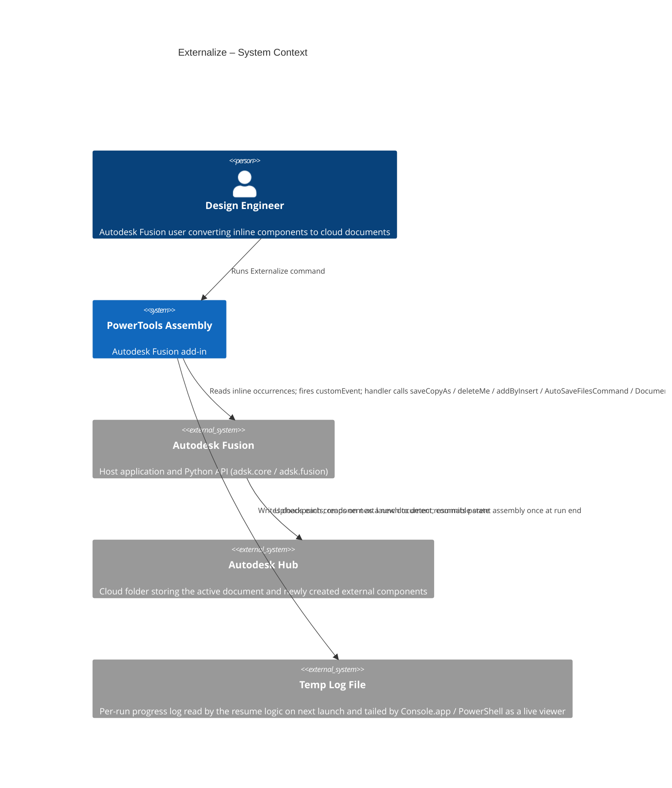
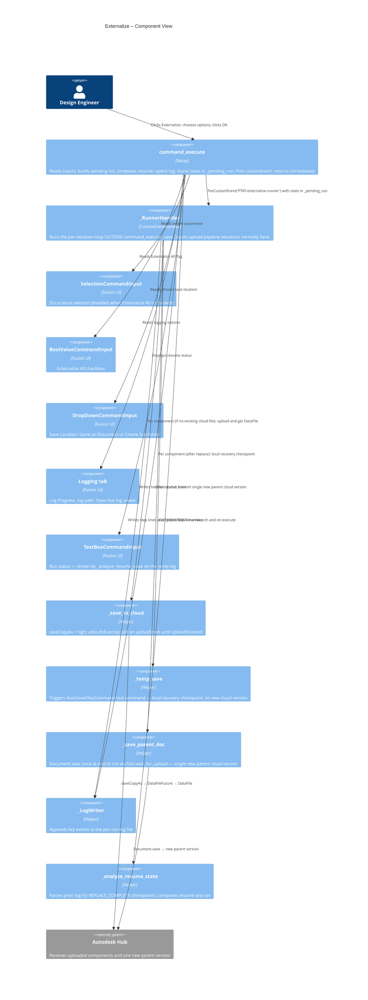

# Externalize

[Back to PowerTools Assembly](../README.md)

The Externalize command converts one or more local (inline) components in the active Autodesk Fusion assembly into independent cloud documents, then re-inserts them at their original positions. Use this command to turn inline geometry into separately versioned, team-shareable files without rebuilding the assembly manually.

## What you can do

- Externalize a single selected component occurrence in the active assembly.
- Externalize all local first-level components in the active assembly with the **Externalize All** option.
- Save externalized components to the same folder as the active document, or to a new sub-folder named after the active document.
- Reuse an existing cloud file automatically if a file with the same name already exists in the target folder.
- Preserve the position and orientation of each component exactly as it was in the original assembly.
- Watch progress on the Fusion status bar (per-component progress) or in an optional live log viewer.
- Resume a prior run that was interrupted: the command detects which components already completed and processes only the remaining ones.
- Get a single new parent assembly version at the end of the run (one cloud-committing save, regardless of how many components were externalized).
- Stay crash-safe mid-run via Fusion's recovery save, triggered between iterations.

## Prerequisites

- An Autodesk Fusion 3D Design must be active.
- The active document must be saved to an Autodesk Hub folder. Externalized components are saved to that same folder (or a sub-folder of it).

## How to use Externalize

### Externalize a single component

1. Open the Autodesk Fusion Design workspace with an active saved assembly.
2. On the **Power Tools** panel, select **Externalize**.
3. In the dialog's **Main** tab, select the component occurrence you want to externalize in the canvas or browser.
4. In the **Save Location** dropdown, choose one of the following:

   | Option | Behavior |
   | --- | --- |
   | **Same as Document** | Saves the external document in the same Hub folder as the active assembly |
   | **Create Sub-folder** | Saves the external document in a new sub-folder named after the active assembly |

5. (Optional) Switch to the **Logging** tab to disable logging or change the log file location.
6. Select **OK**. The dialog closes immediately and the run starts in the background; watch the live log viewer for progress.

The command uploads the component to the target folder, removes the inline occurrence, re-inserts the new external document at the same position and orientation, then commits the parent assembly as a single new version.

### Externalize all local components

1. Follow steps 1–2 above.
2. In the dialog, select the **Externalize All** checkbox. The component selector becomes unavailable.
3. Choose a save location and select **OK**.

Each local first-level component is processed in sequence. Watch the live log viewer for progress. When the run completes, a summary message reports how many components were processed; the parent assembly has been saved once with every successful replacement committed.

> **Note:** If a component cannot be externalized (for example, the upload fails), it is skipped and recorded in the log. All successfully externalized components are still re-inserted and committed.
>
> **Note:** If a cloud file with the same name already exists in the target folder, the command reuses that file instead of creating a duplicate.
>
> **Note:** While a run is in progress, starting another Externalize run is refused with a message — wait for the current one to finish.

### Resume an interrupted run

If a previous run did not finish (Fusion crash, machine sleep, force-quit), the command's **Run status** field on the **Main** tab tells you what's available:

- **"Resume available — N of M already done"** — Selecting OK starts a run that skips the already-completed components and processes only what's left.
- **"Previous run completed successfully…"** — The log will be reset for a fresh run.
- **"A full run will start"** — No usable prior run was found.

Resume is keyed on the components currently in the assembly and the active Fusion client version, so changing either invalidates the prior run and starts fresh. The mid-run recovery checkpoint (`AutoSaveFilesCommand`) means in-memory replacements are preserved against crashes; on a fresh launch the resume logic uses the per-component CHECKPOINT markers to know what's been replaced.

### Logging

The **Logging** tab controls the per-run log:

| Input | Default | Behavior |
| --- | --- | --- |
| **Log Progress** | On | Writes per-step progress to a text log file in the OS temp folder |
| **Log file path** | Auto from active document name | Click **Browse…** to choose a custom location |
| **Open live log viewer** | On | Auto-opens Console.app (macOS) or a PowerShell tail window (Windows) when the run starts |

Log lines are short and focused on key events:

```text
===== Externalize run started 2026-05-08T08:14:21 =====
Fusion client version: 2702.1.58
Active Document: Tran_kutija_v3v4_v5
Target folder: Amazon
Externalize All: True
Components to process: 9 (skipped from prior run: 0)
Run scheduled: 9 components (0 skipped from prior run). Firing customEvent…
fireCustomEvent returned True; dialog will close now.
[1/9] uploading Component2…
  still waiting on Component2 (5s)
[1/9] uploaded Component2 (6.1s)
[1/9] replacing Component2…
[1/9] replaced Component2
CHECKPOINT|REPLACE_COMPLETE|component=Component2|index=1
[2/9] reused Component3
[2/9] replacing Component3…
[2/9] replaced Component3
CHECKPOINT|REPLACE_COMPLETE|component=Component3|index=2
…
Saving parent design (pre_version=2)…
Save+upload completed for parent assembly (version 2 -> 3)
Externalize completed successfully. 9 of 9 replaced this run; 0 from prior run.
```

`CHECKPOINT|REPLACE_COMPLETE|component=…|index=…` lines are machine-parseable markers used by the resume logic. During long uploads, a heartbeat line `still waiting on <name> (Ns)` is emitted every 5 seconds.

## Access

The **Externalize** command is located on the **Utilities** tab, in the **Power Tools** panel of the Autodesk Fusion Design workspace.

## Architecture

The actual save/replace work runs **outside** `command_execute`, in a Fusion `CustomEvent` handler that the command fires before returning. This is required because `Component.saveCopyAs`'s upload pipeline does not advance while `command_execute` holds the main thread (Autodesk forum [11164467](https://forums.autodesk.com/t5/fusion-api-and-scripts-forum/datafilefuture-uploadstate-is-not-updating-when-commandinputs/td-p/11164467)). In a custom-event handler, the same call completes in a few seconds.

### System context



### Component view



### Per-run sequence

```mermaid
sequenceDiagram
  autonumber
  participant U as User
  participant Cmd as command_execute
  participant H as _RunnerHandler
  participant Save as _save_to_cloud
  participant API as Fusion API
  participant Hub as Autodesk Hub

  U->>Cmd: OK
  Cmd->>Cmd: read inputs, build pending list, write log header
  Cmd->>API: app.fireCustomEvent('PTAT-externalize-runner')
  Cmd-->>U: dialog closes
  Note over Cmd,H: command_execute returns; handler runs in customEvent context

  H->>API: design.activeProduct, root.occurrences
  loop for each component in pending list
    H->>API: _find_existing_cloud_file(folder, name)
    alt file already exists
      API-->>H: DataFile (reused)
    else upload needed
      H->>Save: saveCopyAs(component, folder, name)
      Save->>API: component.saveCopyAs(...)
      API-->>Save: DataFileFuture (uploadState=Processing)
      loop tight adsk.doEvents() spin
        Save->>API: future.uploadState
      end
      Save-->>H: DataFile
    end
    H->>API: occurrence.deleteMe()
    H->>API: addByInsert(DataFile, transform, isReferenced=True)
    H->>API: AutoSaveFilesCommand.execute() (local recovery save)
    H->>H: log CHECKPOINT|REPLACE_COMPLETE|...
  end
  H->>API: parent_doc.save('Externalize: N components replaced')
  API->>Hub: upload new parent version
  H-->>U: summary message box
```

### Why customEvent

A direct `saveCopyAs` from inside `command_execute` returns a `DataFileFuture` whose `uploadState` never transitions away from `Processing` — Fusion's upload pipeline does not advance while a command with CommandInputs holds the main thread. Cancelling the command makes the queued uploads land on the server, which is the smoking-gun observation behind the architecture. Moving the loop into a `CustomEvent` handler — fired from `command_execute`, executed *after* the dialog closes — gets us into a context where the same call completes in a few seconds. This was validated with an isolation spike before the refactor.

`AutoSaveFilesCommand` between iterations creates a local recovery save (no new cloud version) so a crash mid-run doesn't lose the in-progress replacements. The single `Document.save` at the end commits exactly one new parent assembly version, regardless of how many components were externalized.

---

[Back to PowerTools Assembly](../README.md)

---

*Copyright © 2026 IMA LLC. All rights reserved.*
