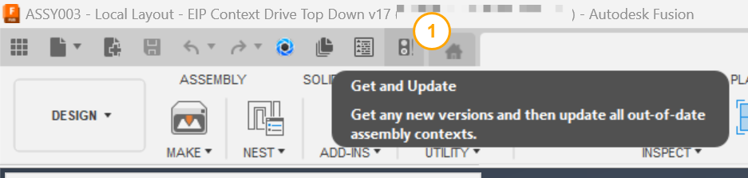
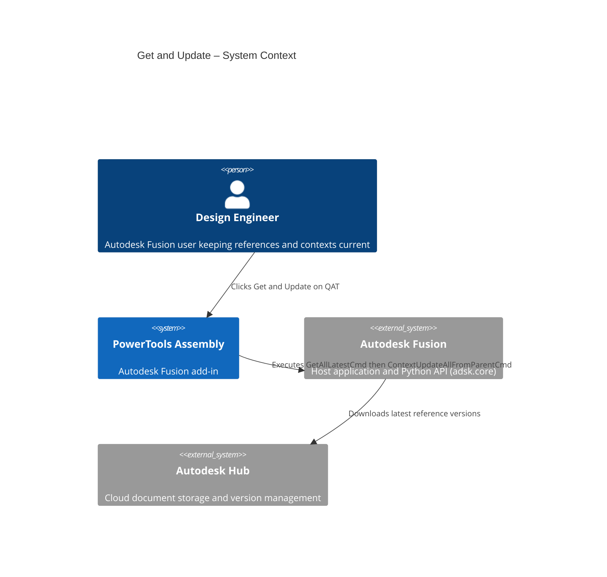
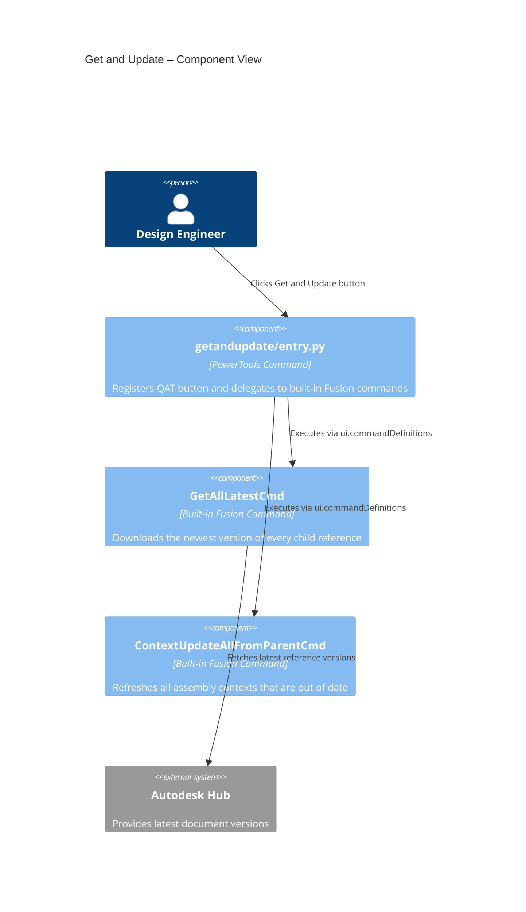

# Get and Update

[Back to PowerTools Assembly](../README.md)

The Get and Update command retrieves the latest versions of all child references and then immediately updates all out-of-date assembly contexts in a single operation. Use this command instead of the default Autodesk Fusion **Get Latest** button when you need to ensure that both document versions and their derived assembly contexts are current.

## What you can do

- Retrieve the latest version of all referenced documents with a single click.
- Automatically update all out-of-date assembly contexts immediately after getting the latest versions.
- Replace the two-step (sometimes multi-step) manual process of getting latest and then updating contexts.
- Access the command directly from the Quick Access Toolbar for fast, repeatable use.

## Prerequisites

- A Autodesk Fusion 3D Design with external references must be active.
- The document must be saved to an Autodesk Hub.

## How to use Get and Update

1. On the Quick Access Toolbar (QAT), select the **Get and Update** button.
2. Autodesk Fusion executes **Get All Latest** to download the newest versions of all child references.
3. Autodesk Fusion then executes **Update All Contexts From Parent** to refresh all assembly contexts that depend on the updated references.
4. Review the assembly to confirm references and contexts are current.

> **Tip:** If Autodesk Fusion shows a yellow triangle indicator on the QAT, that signal means at least one child reference has a newer version. Run Get and Update to resolve the indicator and update all derived contexts in one step.

## Access

The **Get and Update** command is located on the Autodesk Fusion **Quick Access Toolbar (QAT)**.

## Architecture

The following diagram shows how the Get and Update command interacts with Autodesk Fusion.

---

[Back to PowerTools Assembly](../README.md)

---

*Copyright © 2026 IMA LLC. All rights reserved.*
