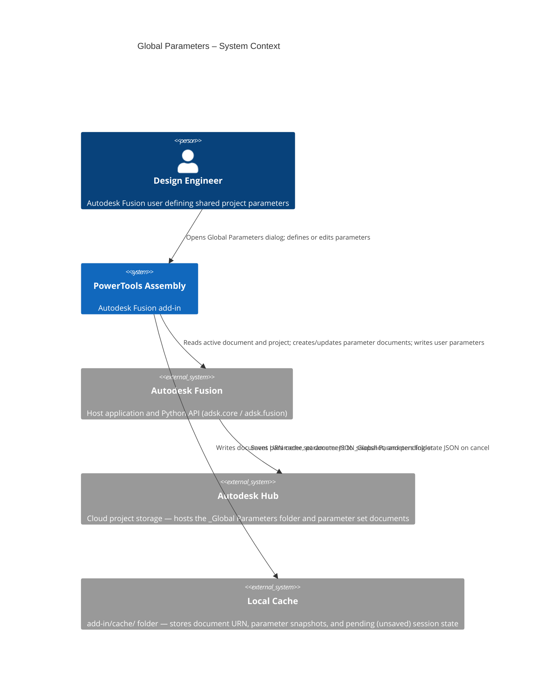
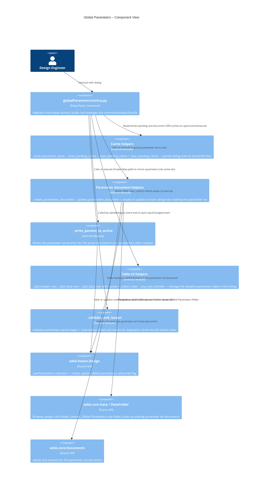
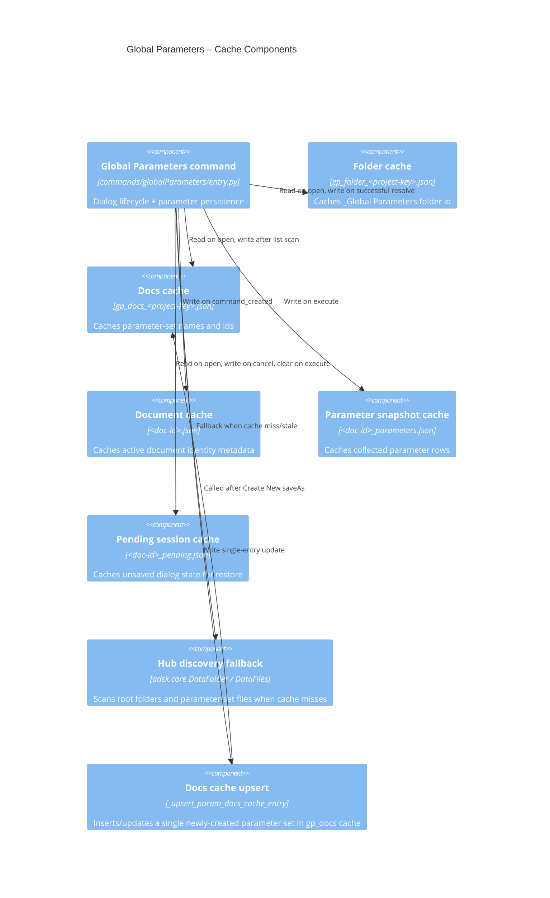
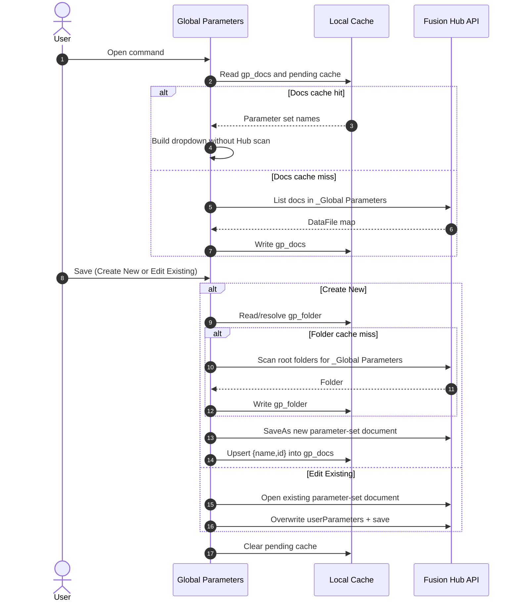
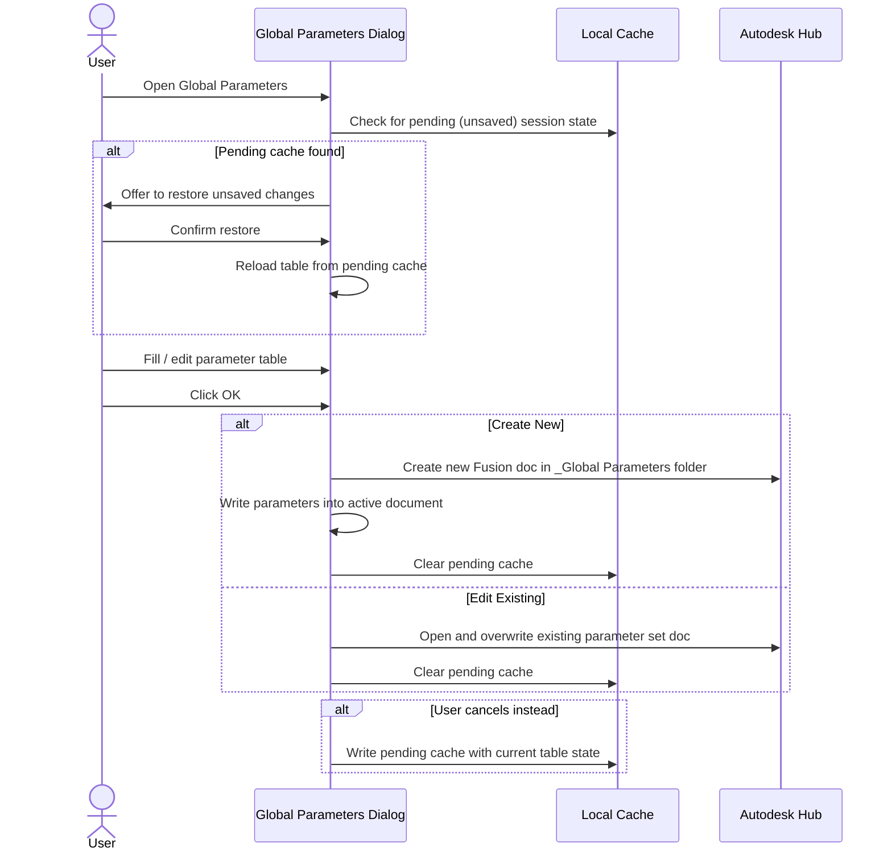

# Global Parameters

[Back to PowerTools Assembly](../README.md)

The Global Parameters command creates and manages a shared parameter set for the active Autodesk Fusion project. Parameters are stored in a dedicated Fusion document inside the `_Global Parameters` folder at the project root, making them available to any document in the project via the **Link Global Parameters** command.

## What you can do

- Create a new named parameter set for the active project.
- Edit an existing parameter set — add, modify, or remove parameters.
- Define parameters with a name, numeric value, unit (in, ft, mm, cm, m), and optional comment.
- Mark parameters as Fusion favorites so they appear in the Favorites panel of any consuming document.
- Restore unsaved changes from a previous session if the dialog was cancelled before saving.
- Use warm-start discovery caches to reduce project folder scanning and startup latency.

## Prerequisites

- An Autodesk Fusion 3D Design must be active.
- The active document must be saved to an Autodesk Hub project.

## How to use Global Parameters

### Create a new parameter set

1. Open the Autodesk Fusion Design workspace.
2. On the **Power Tools** panel, select **Global Parameters**.
3. The **Parameter Set** dropdown defaults to **Create New**. Leave it set to **Create New**.
4. In the **Name** field, enter a descriptive name for the parameter set (for example, `Enclosure Constants`).
5. Use the table to define your parameters:

   | Column | Description |
  | --- | --- |
   | (checkbox) | Select a row to enable the **Delete** toolbar button |
   | Name | Parameter name — must start with a letter; letters, digits, `_`, `"`, `$`, `°`, `µ` are allowed |
   | Value | Numeric value |
   | Unit | Unit from the dropdown (in, ft, mm, cm, m) |
   | Comment | Optional free-text description |

6. Use the **Add** toolbar button to insert additional parameter rows.
7. Use the **Delete** toolbar button to remove selected rows.
8. Select **OK** to save.

The command creates a new Fusion design document with the parameter set name in the `_Global Parameters` folder of the active project, and also writes the parameters directly into the active document.

### Edit an existing parameter set

1. Open the Autodesk Fusion Design workspace.
2. On the **Power Tools** panel, select **Global Parameters**.
3. In the **Parameter Set** dropdown, select the name of the parameter set you want to edit.
4. The table populates with the existing parameters.
5. Make your changes and select **OK** to save.

> **Note:** Once you select an existing parameter set, the dropdown locks for that session to prevent accidental mode switching after data has been loaded.

### Restore unsaved changes

If you cancelled the dialog in a previous session before saving, the command detects the saved state and offers to restore it. Select **Yes** in the prompt to reload the previous table contents.

## Access

The **Global Parameters** command is on the **Power Tools** panel in the **Tools** tab of the Autodesk Fusion Design workspace.

## Parameter name rules

| Rule | Detail |
| --- | --- |
| Must start with a letter | Digits and symbols are not allowed as the first character |
| Allowed characters | Letters, digits, `_`, `"`, `$`, `°`, `µ` |
| Case-sensitive | `Width` and `width` are treated as different parameters |
| Reserved names | Fusion unit names (`mm`, `in`, `ft`, `deg`, `rad`, `kg`, `s`, `pi`, etc.) are not allowed as parameter names |
| Duplicate names | Each parameter name must be unique within the set |

## Architecture

The following diagrams show how the Global Parameters command interacts with Autodesk Fusion and the project data model.

## Caching and Discovery Logic

Global Parameters uses layered cache reads before any Hub scan:

1. `gp_folder_<project-key>.json`: project-scoped folder id cache for `_Global Parameters`.
2. `gp_docs_<project-key>.json`: project-scoped parameter set list used to pre-populate the Parameter Set dropdown.
3. `<active-doc-id>_pending.json`: cancel-time unsaved session restore payload.
4. `<active-doc-id>_parameters.json`: last collected table rows snapshot.

When cache-based resolution fails, the command falls back to Hub scans and then refreshes cache files. On **Create New**, the command also upserts the new parameter-set `{name,id}` into `gp_docs_<project-key>.json` immediately so Link Global Parameters can discover it without waiting for a full rescan.

