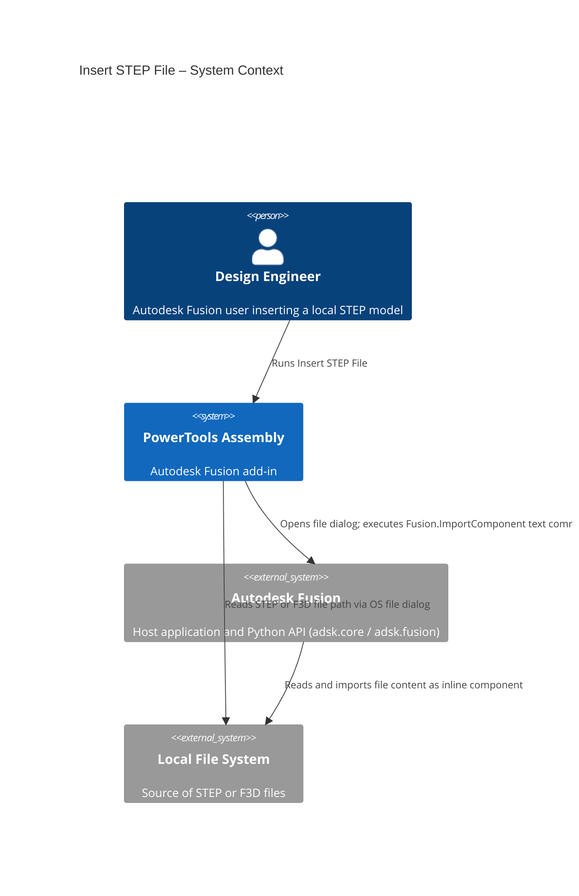
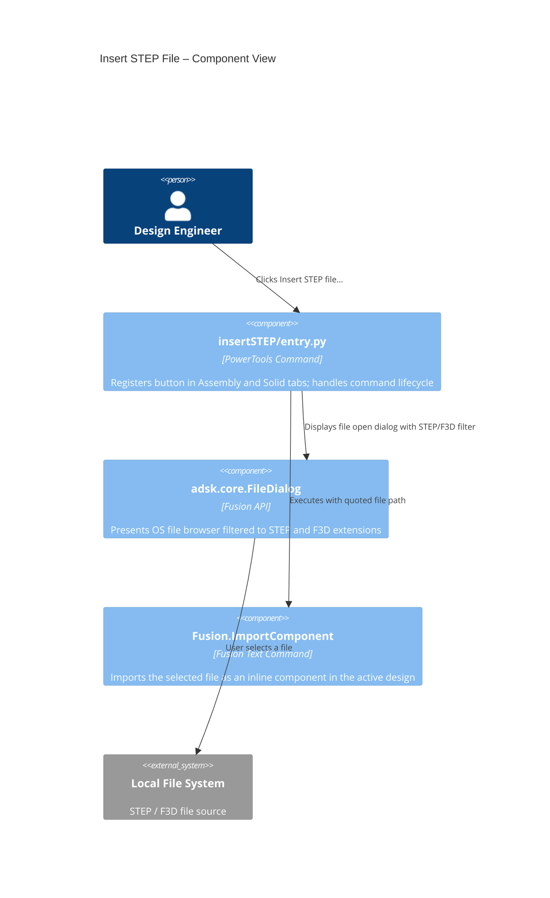

# Insert STEP File

[Back to PowerTools Assembly](../README.md)

The Insert STEP File command lets you browse your local computer for a STEP or F3D file and insert it directly as a component in the active Autodesk Fusion design document. Use this command when you want to incorporate a STEP model into an existing assembly without first uploading the file to an Autodesk Hub or opening it in a separate document tab.

## What you can do

- Browse the local file system for STEP files (`.stp`, `.step`, `.STP`, `.STEP`) and Fusion archive files (`.f3d`).
- Insert the selected file as a local inline component in the active design in a single step.
- Skip the Hub upload or separate-tab workflow when you only need a STEP model as a component in the current design.
- Use the command in ECAD workflows to load a mechanical STEP model into a PCB 3D package design tool directly.

## Prerequisites

- A Autodesk Fusion 3D Design must be active.
- The STEP or F3D file must be accessible on the local file system.

## How to use Insert STEP File

1. Open the Autodesk Fusion Design workspace with an active 3D design.
2. Locate the **Insert STEP file…** command using one of the access paths described in the [Access](#access) section below.
3. In the file browser dialog, navigate to the STEP or F3D file you want to insert.
4. Select the file and select **Open**.
5. Autodesk Fusion inserts the file as a local component at the origin of the active design.

> **Note:** The inserted component is stored inline with the parent document. To make it an independent cloud document that can be shared or versioned separately, use the [Externalize](./Externalize.md) command after insertion.

## Access

The **Insert STEP file…** command appears in one of two locations depending on whether the Assembly Tab preview feature is enabled in your Autodesk Fusion installation:

| Condition | Panel location |
|---|---|
| Assembly Tab preview **enabled** | **Assembly** tab > **Assemble** panel |
| Assembly Tab preview **not enabled** | **Solid** tab > **Insert** panel |

## Architecture

The following diagram shows how the Insert STEP File command interacts with Autodesk Fusion.

---

[Back to PowerTools Assembly](../README.md)

---

*Copyright © 2026 IMA LLC. All rights reserved.*
