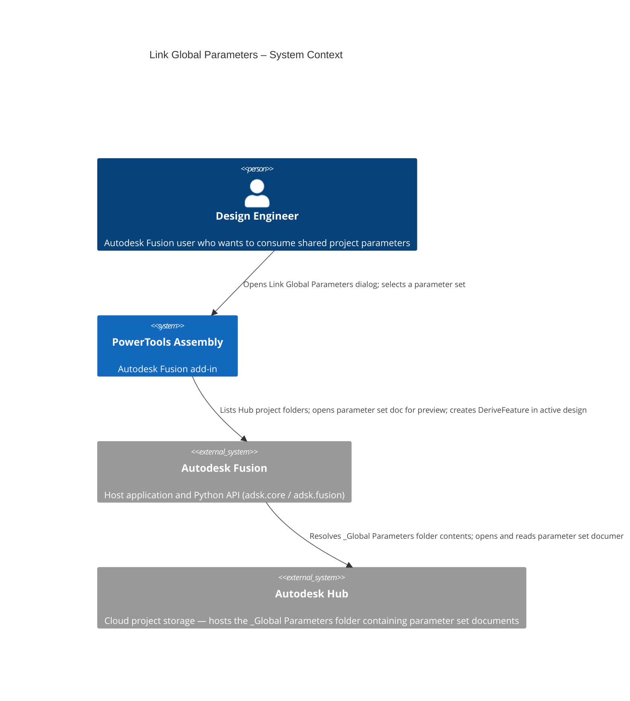
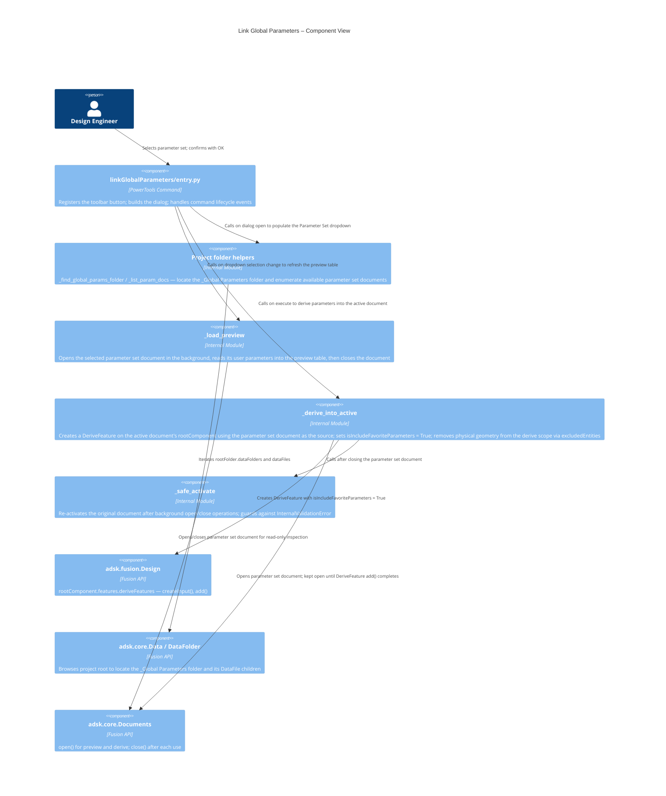
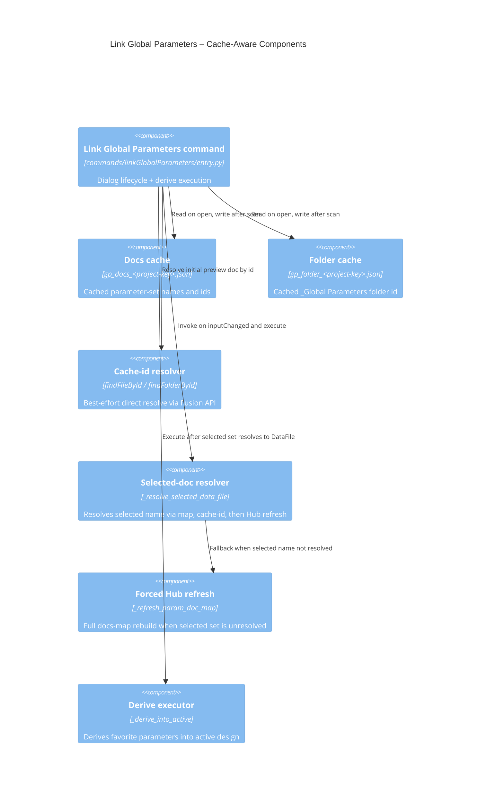
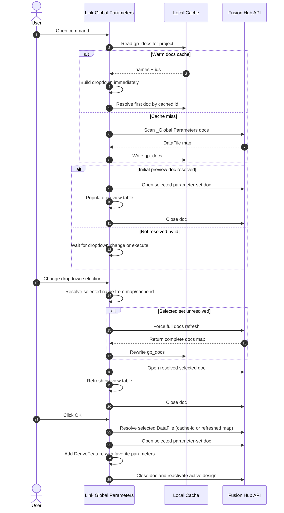
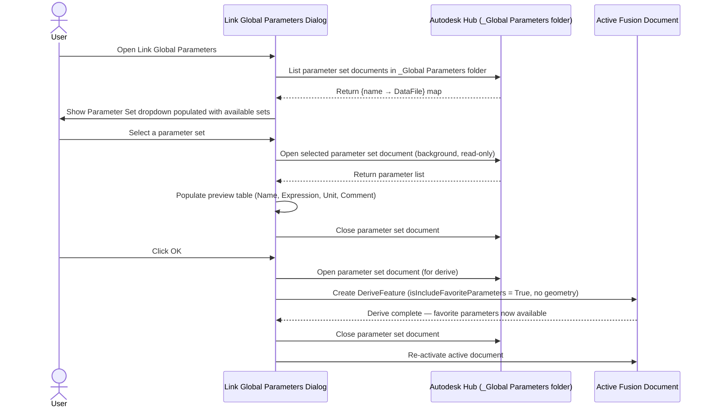

# Link Global Parameters

[Back to PowerTools Assembly](../README.md)

The Link Global Parameters command derives a parameter set from a shared parameters document into the active Autodesk Fusion document. It reads the parameter set created by the **Global Parameters** command from the `_Global Parameters` folder of the active project and inserts those parameters as a Derive feature in the active design.

## What you can do

- Browse all parameter sets available in the active project's `_Global Parameters` folder.
- Preview the parameters in a selected parameter set before committing.
- Derive the selected parameter set into the active document as favorite parameters so they are immediately available in Fusion's Favorites panel and in design expressions.
- Use cached project discovery data for faster startup, with lazy Hub scan fallback when needed.

## Prerequisites

- An Autodesk Fusion 3D Design must be active and saved to an Autodesk Hub project.
- At least one parameter set must exist in the project (created with the **Global Parameters** command).

## How to use Link Global Parameters

1. Open the Autodesk Fusion Design workspace with the target document active.
2. On the **Power Tools** panel, select **Link Global Parameters**.
3. In the **Parameter Set** dropdown, select the parameter set you want to link.
4. The preview table updates to show the parameters in the selected set:

   | Column | Description |
  | --- | --- |
   | Name | Parameter name as defined in the parameter set document |
   | Expression | Stored expression (e.g. `25.4 mm`) |
   | Unit | Unit string |
   | Comment | Optional comment (the `PT-globparm` sentinel prefix is stripped from the display) |

5. Confirm the parameters look correct, then select **OK**.

The command derives the parameter set document into the active design. All parameters marked as favorites in the parameter set document are inserted into the active document and appear in its Favorites panel.

> **Note:** The derive operation temporarily opens the parameter set document in the background and closes it when done. Focus returns to the active document automatically.

## Access

The **Link Global Parameters** command is on the **Power Tools** panel in the **Tools** tab of the Autodesk Fusion Design workspace.

## Refresh Global Parameters Cache

If parameter sets appear missing or out of date in the Link Global Parameters dialog, use the **Refresh Global Parameters Cache** command. This command forces a full scan of the Autodesk Hub project and rewrites the local caches for the active project, ensuring that all available parameter sets are discovered and up to date.

- **Location:** File → PowerTools Settings
- **When to use:** If you add, remove, or rename parameter sets outside of the add-in, or if the dropdown in Link Global Parameters does not show the latest sets.

After running this command, re-open the Link Global Parameters dialog to see the refreshed list of parameter sets.

## Architecture

The following diagrams show how the Link Global Parameters command interacts with the parameter set documents and the active design.

## Caching and Discovery Logic

Link Global Parameters now uses a cache-first startup path:

1. Read `gp_docs_<project-key>.json` to populate the Parameter Set dropdown.
2. Read `gp_folder_<project-key>.json` for fast `_Global Parameters` folder resolution.
3. Attempt direct id-based `DataFile` resolve for initial preview.
4. Resolve dropdown selection by name using cache-id fast path first.
5. If a selected set is still unresolved (for example, partial in-memory map), force a full Hub refresh and retry.

This reduces command-created latency in large projects where root folder enumeration is expensive.

