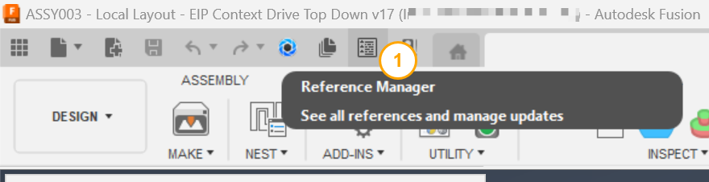
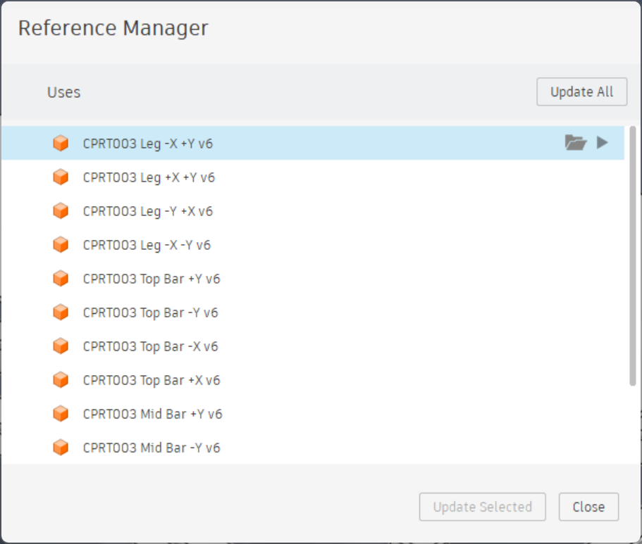
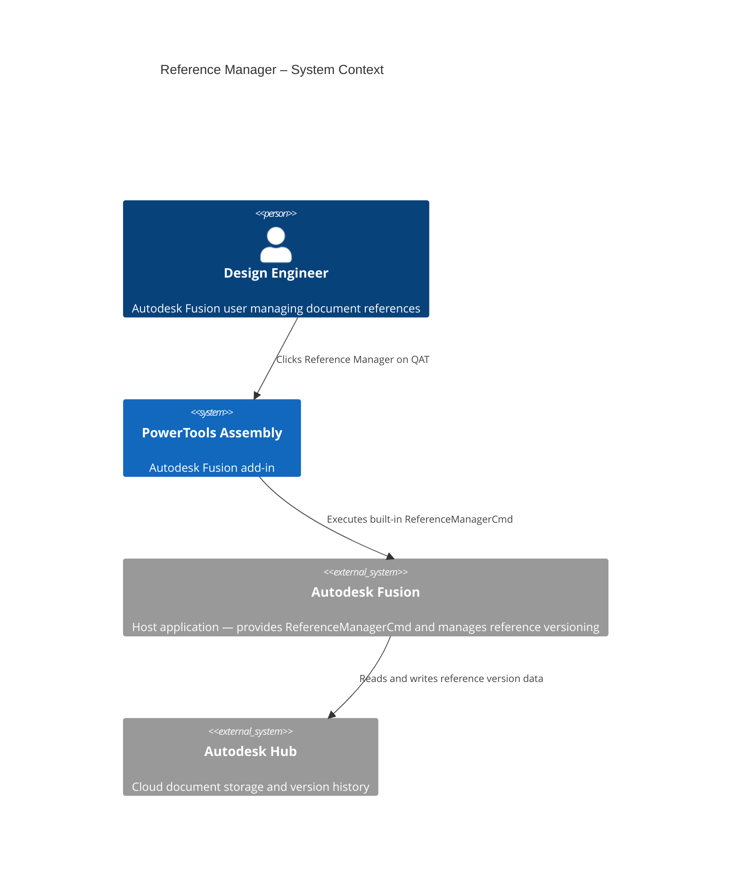
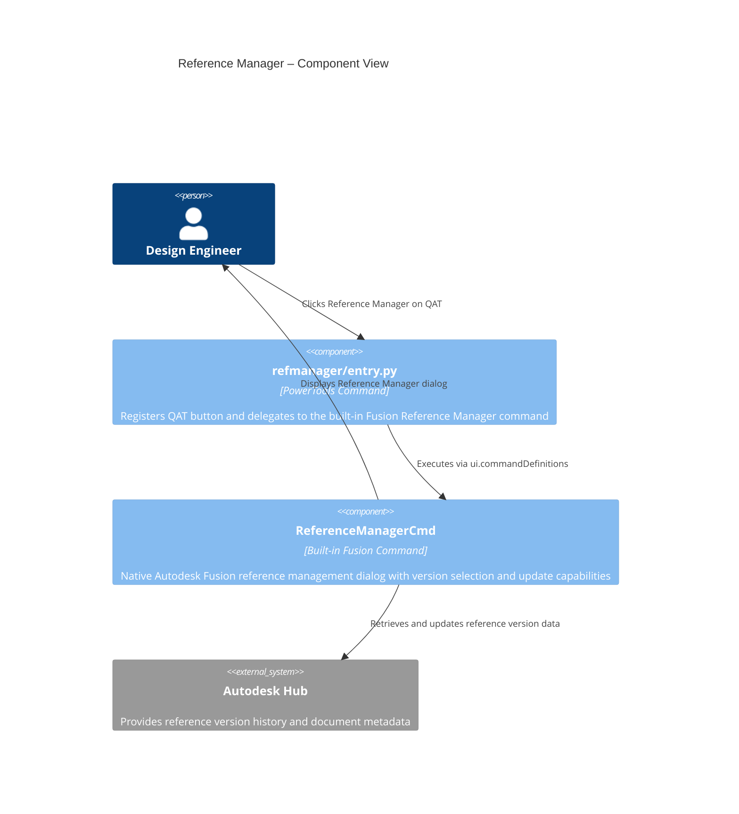

# Reference Manager

[Back to PowerTools Assembly](../README.md)

The Reference Manager command opens the Autodesk Fusion Reference Manager dialog directly from the Quick Access Toolbar. Use this command to review, update, and manage all references in the active document without navigating through nested menus or the Manufacture workspace.

## What you can do

- View all external document references for the active design in one place.
- Update all references to their latest versions in a single action.
- Update individual references selectively, choosing which documents to update.
- Select a specific version for individual references when you need to control which version is used.
- Open any referenced document in a new Autodesk Fusion tab for editing or review.

## Prerequisites

- A Autodesk Fusion 3D Design must be active.
- The document must contain at least one external reference.

## How to use Reference Manager

1. On the Quick Access Toolbar (QAT), select the **Reference Manager** button.
2. The Autodesk Fusion Reference Manager dialog opens, displaying all references in the active document.
3. Use the dialog to perform any of the following actions:

   | Action | How to perform it |
   |---|---|
   | Update all references | Select **Update All** in the dialog |
   | Update one reference | Select the reference row, then select **Update** |
   | Select a specific version | Select the reference row, expand the version list, and choose the desired version |
   | Open a reference | Select the reference row, then select **Open** |

4. Select **OK** or **Close** to dismiss the dialog.

> **Tip:** The Reference Manager is a native Autodesk Fusion tool also available in the Manufacture workspace nesting workflow. This command exposes it in the QAT for quick access from any design session.

## Access

The **Reference Manager** command is located on the Autodesk Fusion **Quick Access Toolbar (QAT)**, positioned next to the **Get and Update** button.

## Architecture

The following diagram shows how the Reference Manager command interacts with Autodesk Fusion.

---

[Back to PowerTools Assembly](../README.md)

---

*Copyright © 2026 IMA LLC. All rights reserved.*
