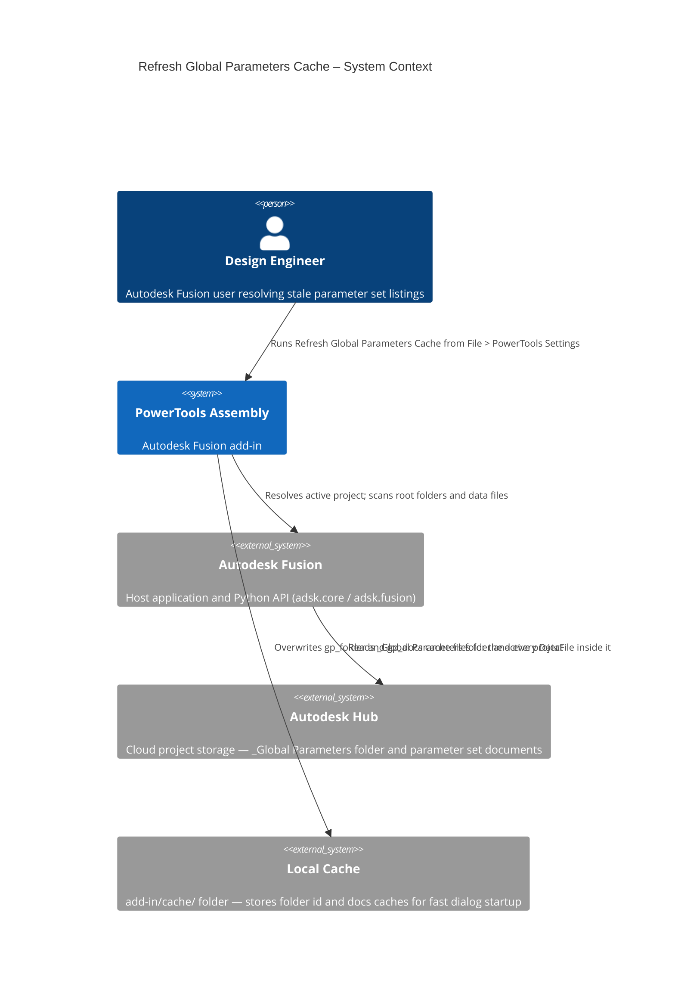
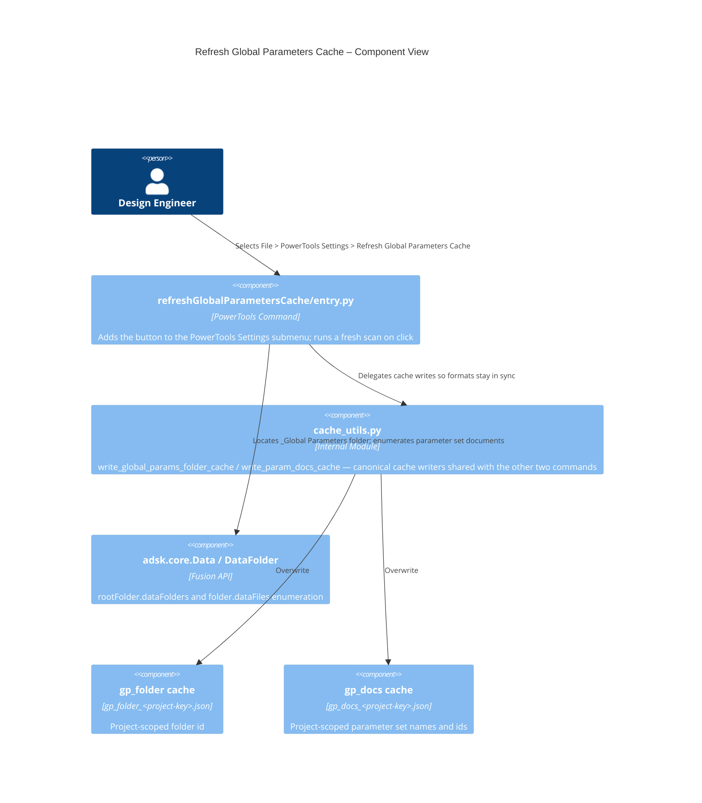
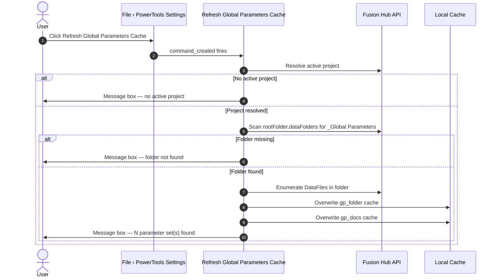

# Refresh Global Parameters Cache

[Back to PowerTools Assembly](../README.md)

The Refresh Global Parameters Cache command forces a full scan of the active Autodesk Hub project's `_Global Parameters` folder and rewrites the local cache files that **Global Parameters** and **Link Global Parameters** use for fast dialog startup. Use it when parameter sets appear missing, stale, or out of order in those dialogs — typically after adding, removing, or renaming parameter set documents outside the add-in.

## What you can do

- Force a complete rescan of the active project's `_Global Parameters` folder, bypassing any cached folder or document metadata.
- Rewrite `gp_folder_<project-key>.json` and `gp_docs_<project-key>.json` so the other two commands pick up the refreshed list on next open.
- Receive a summary message box reporting how many parameter sets were found in the project.

## Prerequisites

- An Autodesk Fusion document must be active and the Data Panel must resolve an active project.
- The active project must contain a `_Global Parameters` folder (created by **Global Parameters**).

## How to use Refresh Global Parameters Cache

1. Open the Autodesk Fusion Design workspace with any document from the target project active.
2. Open the **File** dropdown on the Quick Access Toolbar (QAT).
3. Expand the **PowerTools Settings** submenu.
4. Select **Refresh Global Parameters Cache**.

The command scans the project root for the `_Global Parameters` folder, enumerates every parameter set document inside it, and overwrites both cache files. A message box reports how many parameter sets were found.

> **Note:** If the project has no `_Global Parameters` folder, the command reports that no folder was found and exits without writing anything.

## Access

The **Refresh Global Parameters Cache** command is located under **File › PowerTools Settings** on the Quick Access Toolbar. The PowerTools Settings submenu is shared with other PowerTools add-ins — if it does not yet exist, the command creates it on first run.

## Architecture

---

[Back to PowerTools Assembly](../README.md)

---

*Copyright © 2026 IMA LLC. All rights reserved.*
